# 水务系统生产测试模块业务设计文档

---

**文档信息**

| 项目 | 内容 |
|------|------|
| 项目名称 | 水务系统生产测试模块 |
| 文档版本 | V1.0 |
| 创建日期 | 2026年3月20日 |
| 文档作者 | MiniMax Agent |
| 技术框架 | BladeX-Boot + MyBatis-Plus + Redis |
| 数据库 | MySQL 8.0 |
| 权限系统 | BladeX权限系统 |

---

## 第一章 项目概述

### 1.1 项目背景与目标

随着智慧水务行业的快速发展，智能水表设备的生产测试管理成为水务厂家核心的生产环节。当前水务生产厂家面临以下业务挑战：

第一，备货单管理效率低下。传统模式下，一次备货单通常包含10000支智能水表，人工记录和管理备货单号的工作量巨大，容易出现单号混淆、记录错误等问题。生产人员需要在每个环节手动登记设备状态，导致生产效率低下且难以追溯。

第二，测试流程缺乏标准化。智能水表需要经过严格的功能测试才能出厂，测试内容包括通讯测试、阀门测试、流量精度测试等。当前缺乏统一的测试标准和自动化测试流程，导致测试结果的一致性和可靠性难以保证。

第三，设备状态管理分散。设备从入库、测试、出库到包装的完整生命周期中，状态信息分散在不同环节，缺乏统一的状态管理机制。出现质量问题时难以快速定位问题批次和问题设备。

第四，数据追溯困难。30万台智能水表设备的测试数据和历史记录需要长期保存，用于质量分析和售后服务。但当前缺乏有效的数据归档和查询机制，历史数据查询效率低下。

基于以上业务痛点，本项目旨在构建一套完整的智能水表生产测试管理系统，实现备货单管理、仓库管理、批次管理、批量测试、测试历史追溯和包装管理全流程的数字化管理。

### 1.2 设备规模与数据规模

**设备规模指标**

| 指标名称 | 指标值 | 说明 |
|----------|--------|------|
| 设备总量 | 30万台 | 系统管理的智能水表设备总量 |
| 设备类型 | 智能水表 | 支持物联网通信的水表设备 |
| 通信模块 | Cat1/NB-IoT | 支持4G Cat1和NB-IoT双模通信 |

**数据规模指标**

| 指标名称 | 指标值 | 说明 |
|----------|--------|------|
| 日增数据量 | 300万条 | 正常上报10条/台/天 |
| 历史数据保留 | 3年 | 支持历史数据查询和追溯 |
| 公共表保留 | 15天 | 上报数据和冻结数据保留周期 |
| 指令表保留 | 7天 | 终态指令保留周期 |

### 1.3 支持的协议类型

系统支持三种主流水表通信协议：

| 协议类型 | protocol_type | 版本 | 说明 |
|----------|---------------|------|------|
| SR协议 | 1 | V1.1.2 | Cat1物联网水表通讯协议，支持Cat1/NB-IoT通信模块 |
| 恩乐曼协议 | 2 | V2.0.0 | 恩乐曼厂商专用协议，NB-IoT透传模式 |
| CJT188协议 | 3 | 2004 | 国标户用计量仪表数据传输协议 |

### 1.4 术语表

| 术语 | 英文 | 定义 |
|------|------|------|
| 备货单号 | WO | Work Order，批次工作单号，格式WO-YYYYMMDD-序号 |
| 测试批号 | BATCH | 批次测试编号，格式BATCH-YYYYMMDD-序号 |
| 水表表号 | MeterNo | 智能水表唯一标识，14位数字编码 |
| IMEI | IMEI | 设备国际移动台识别码，15位数字 |
| ICCID | ICCID | SIM卡集成电路卡识别码，20位数字 |
| SKU | SKU | 库存量单位，本项目中指单个水表设备 |
| 箱号 | BoxNo | 包装箱编号，用于包装管理 |
| CSQ | CSQ | 信号强度指示 |
| RSRP | RSRP | 参考信号接收功率 |
| RSRQ | RSRQ | 参考信号接收质量 |

---

## 第二章 技术架构设计

### 2.1 系统架构总览

#### 2.1.1 系统拓扑图

系统采用**三层架构**：感知层（设备端）、网络层（外协服务器）、应用层（我方内网服务器）。

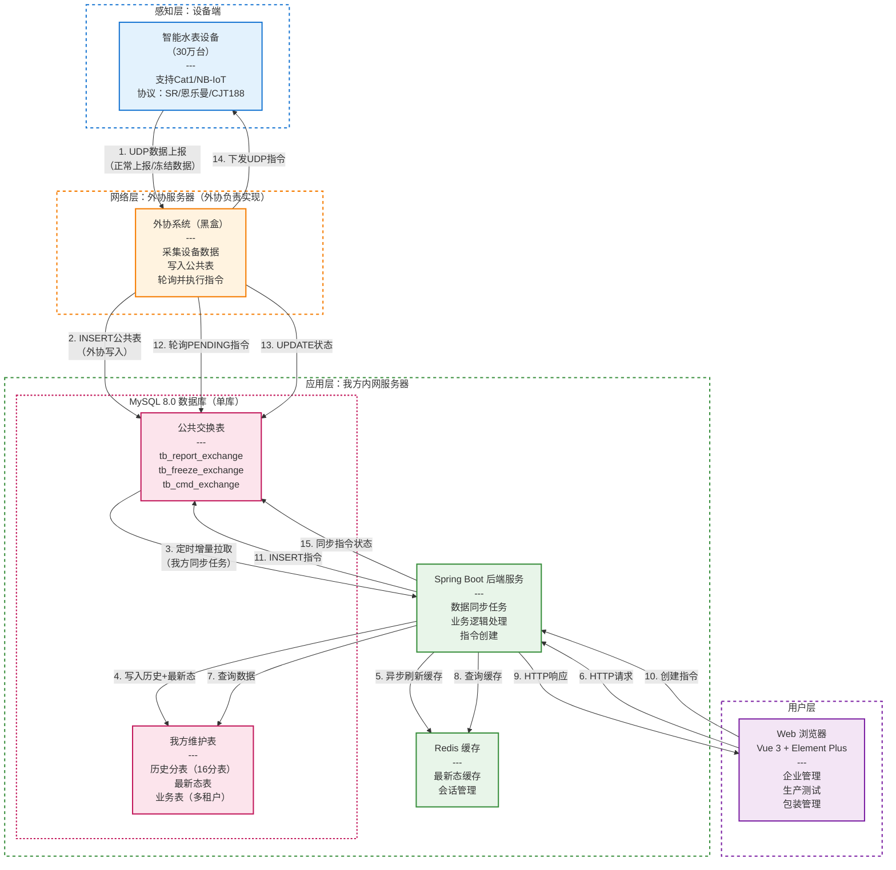

#### 2.1.2 数据流向说明

##### 2.1.2.1 上行数据流（设备数据采集）

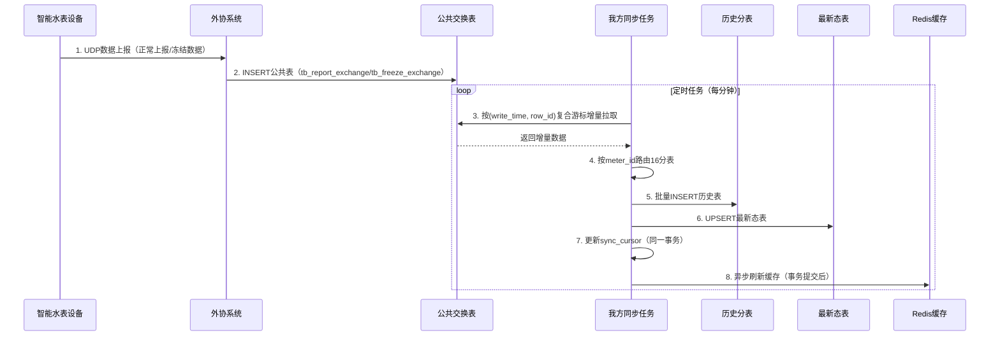

##### 2.1.2.2 下行指令流（指令下发）

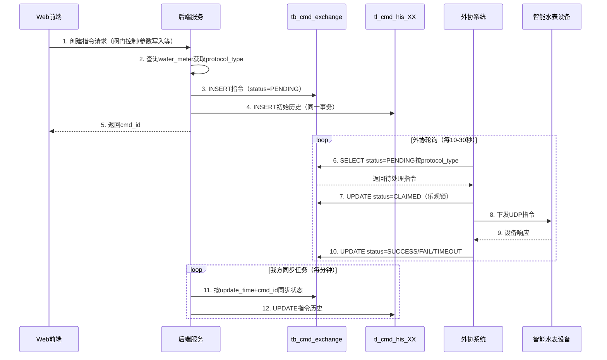

### 2.2 技术选型

#### 2.2.1 后端技术栈

| 技术 | 选型 | 说明 |
|------|------|------|
| 开发框架 | BladeX-Boot | 基于Spring Boot的企业级开发脚手架 |
| 数据库 | MySQL 8.0 | 单库方案，支持分表分区 |
| ORM框架 | MyBatis-Plus | 简化CRUD操作，支持多租户插件 |
| 缓存 | Redis | 最新态缓存、会话管理 |
| 定时任务 | Spring Scheduled | 数据同步任务 |
| 权限管理 | BladeX权限系统 | 复用BladeX的账号、角色、权限体系 |

#### 2.2.2 前端技术栈

| 技术 | 选型 | 说明 |
|------|------|------|
| 开发框架 | Vue 3 | 渐进式JavaScript框架 |
| UI组件库 | Element Plus | Vue 3组件库 |
| 表格组件 | Element Plus Table | 支持虚拟滚动，大数据量渲染 |
| 导入导出 | xlsx | Excel文件处理 |
| 图表 | ECharts | 数据可视化 |

#### 2.2.3 数据库架构

**单库方案**：我方与外协使用同一个MySQL数据库，不拆多个实例。

**分表策略**：
- 历史表：16分表（按meter_id哈希取模）
- 分区策略：
  - 公共表：按天分区（write_time）
  - 历史表：按月分区（event_time/create_time）

**多租户实现**：
- 所有业务表包含 tenant_id 字段
- 拦截器自动注入 tenant_id 条件
- 缓存key包含 tenant_id

### 2.3 关键架构约束

#### 2.3.1 数据同步约束

- 外协系统负责采集设备上报并写入 `tb_report_exchange`、`tb_freeze_exchange`，我方不直接对接设备侧UDP链路。
- 我方同步任务按 `(write_time, row_id)` 复合游标增量拉取，避免仅靠时间戳造成漏数或重数。
- 同步任务在同一事务内完成历史写入、最新态更新和 `sync_cursor` 推进，保证消费位点与落库状态一致。
- Redis刷新在事务提交后异步执行，避免缓存先于数据库可见。

#### 2.3.2 指令下发约束

- 所有下行指令统一写入 `tb_cmd_exchange`，由外协系统按 `protocol_type` 轮询并下发。
- 指令创建时同步写入 `tl_cmd_his_XX` 初始记录，后续状态变化再由同步任务补齐历史。
- 外协通过 `CLAIMED` 状态和乐观锁抢占待处理指令，避免重复执行。
- 我方按 `(update_time, cmd_id)` 增量同步指令状态，保证状态推进可追溯。

#### 2.3.3 存储与缓存约束

- 历史数据按 `meter_id` 路由到16张历史分表，用于承接高频上报明细。
- 最新态表只保留设备最新一条有效状态，支撑前端查询和业务判断。
- Redis仅承担最新态热点缓存和会话管理，不作为指令可靠投递通道。
- 公共交换表属于共享交换区域，我方业务表与公共表职责边界必须明确隔离。

## 第三章 数据库设计

### 3.1 数据库规范

#### 3.1.1 命名规范

| 对象类型 | 命名规范 | 示例 |
|----------|----------|------|
| 数据库 | 小写下划线 | production_system |
| 表名 | 小写下划线_+模块前缀 | dev_设备表, bat_批次表 |
| 字段名 | 小写下划线 | meter_no, create_time |
| 索引名 | idx_表名_字段名 | idx_device_meter_no |
| 唯一索引 | uk_表名_字段名 | uk_device_meter_no |
| 外键名 | fk_表名_关联表 | fk_batch_enterprise |

### 3.2 核心实体设计

#### 3.2.1 企业账户表（sys_enterprise）

```sql
CREATE TABLE sys_enterprise (
    id              BIGINT          NOT NULL    COMMENT '主键ID',
    enterprise_code VARCHAR(50)     NOT NULL    COMMENT '企业编码',
    enterprise_name VARCHAR(200)     NOT NULL    COMMENT '企业名称',
    contact_name    VARCHAR(100)                COMMENT '联系人姓名',
    contact_phone   VARCHAR(20)                 COMMENT '联系电话',
    address         VARCHAR(500)               COMMENT '企业地址',
    status          TINYINT        DEFAULT 1   COMMENT '状态：0-停用，1-正常',
    create_time     DATETIME       DEFAULT CURRENT_TIMESTAMP COMMENT '创建时间',
    update_time     DATETIME       DEFAULT CURRENT_TIMESTAMP ON UPDATE CURRENT_TIMESTAMP COMMENT '更新时间',
    PRIMARY KEY (id),
    UNIQUE KEY uk_enterprise_code (enterprise_code)
) ENGINE=InnoDB DEFAULT CHARSET=utf8mb4 COMMENT='企业账户表';
```

#### 3.2.2 表具档案表（dev_meter_archive）

```sql
CREATE TABLE dev_meter_archive (
    id                  BIGINT          NOT NULL    COMMENT '主键ID',
    archive_name        VARCHAR(200)    NOT NULL    COMMENT '表具名称',
    meter_model         VARCHAR(50)     NOT NULL    COMMENT '表具型号',
    meter_caliber       VARCHAR(20)                 COMMENT '表具口径',
    protocol_type       TINYINT        NOT NULL    COMMENT '通讯协议类型：1-SR协议，2-恩乐曼，3-CJT188',
    has_valve           TINYINT        NOT NULL    COMMENT '有无阀门：0-无阀门，1-有阀门',
    operator            VARCHAR(50)                 COMMENT '运营商：电信/移动',
    manufacturer        VARCHAR(200)                COMMENT '生产厂家',
    remark              VARCHAR(500)                COMMENT '备注',
    create_time         DATETIME       DEFAULT CURRENT_TIMESTAMP COMMENT '创建时间',
    update_time         DATETIME       DEFAULT CURRENT_TIMESTAMP ON UPDATE CURRENT_TIMESTAMP COMMENT '更新时间',
    PRIMARY KEY (id)
) ENGINE=InnoDB DEFAULT CHARSET=utf8mb4 COMMENT='表具档案表';
```

#### 3.2.3 设备信息表（dev_device_info）

```sql
CREATE TABLE dev_device_info (
    id                  BIGINT          NOT NULL    COMMENT '主键ID',
    meter_no            VARCHAR(50)     NOT NULL    COMMENT '水表表号（14位唯一标识）',
    imei                VARCHAR(50)                 COMMENT 'IMEI码',
    iccid               VARCHAR(50)                 COMMENT 'ICCID卡号',
    archive_id          BIGINT                      COMMENT '表具档案ID',
    enterprise_id       BIGINT                      COMMENT '所属企业ID',
    forward_flow        DECIMAL(12,3)   DEFAULT 0  COMMENT '正向累积流量',
    reverse_flow        DECIMAL(12,3)   DEFAULT 0  COMMENT '反向累积流量',
    valve_status        TINYINT        DEFAULT 0   COMMENT '阀门状态：0-关，1-开，2-故障',
    battery_voltage     DECIMAL(5,2)              COMMENT '电池电压',
    preset_reading      DECIMAL(12,3)   DEFAULT 0  COMMENT '预置表底数',
    csq                 INT                         COMMENT 'CSQ信号强度',
    rsrp                INT                         COMMENT 'RSRP信号功率',
    rsrq                INT                         COMMENT 'RSRQ信号质量',
    inventory_status    TINYINT        DEFAULT 0   COMMENT '库存状态：0-在库，1-已出库',
    test_status         TINYINT        DEFAULT 0   COMMENT '测试状态：0-待测，1-合格，2-不合格',
    protocol_type       TINYINT                      COMMENT '通讯协议类型',
    operator            VARCHAR(50)                  COMMENT '运营商',
    user_manufacturer   VARCHAR(200)                COMMENT '用户厂家',
    outbound_time       DATETIME                    COMMENT '出库时间',
    outbound_operator   VARCHAR(100)                COMMENT '出库操作人员',
    remark              VARCHAR(500)                COMMENT '生产备注',
    create_time         DATETIME       DEFAULT CURRENT_TIMESTAMP COMMENT '创建时间',
    update_time         DATETIME       DEFAULT CURRENT_TIMESTAMP ON UPDATE CURRENT_TIMESTAMP COMMENT '更新时间',
    PRIMARY KEY (id),
    UNIQUE KEY uk_meter_no (meter_no),
    KEY idx_enterprise_id (enterprise_id),
    KEY idx_test_status (test_status),
    KEY idx_inventory_status (inventory_status)
) ENGINE=InnoDB DEFAULT CHARSET=utf8mb4 COMMENT='设备信息表';
```

#### 3.2.4 测试批次表（bat_test_batch）

```sql
CREATE TABLE bat_test_batch (
    id                  BIGINT          NOT NULL    COMMENT '主键ID',
    batch_no            VARCHAR(50)     NOT NULL    COMMENT '测试批号',
    wo_no               VARCHAR(50)     NOT NULL    COMMENT '备货单号',
    archive_id          BIGINT                      COMMENT '表具档案ID',
    enterprise_id       BIGINT                      COMMENT '所属企业ID',
    total_count         INT             DEFAULT 0   COMMENT '设备总数',
    pass_count          INT             DEFAULT 0   COMMENT '合格数量',
    fail_count          INT             DEFAULT 0   COMMENT '异常数量',
    pending_count       INT             DEFAULT 0   COMMENT '待测数量',
    remark              VARCHAR(500)                COMMENT '备注',
    status              TINYINT        DEFAULT 0   COMMENT '状态：0-测试中，1-已完成',
    create_time         DATETIME       DEFAULT CURRENT_TIMESTAMP COMMENT '创建时间',
    update_time         DATETIME       DEFAULT CURRENT_TIMESTAMP ON UPDATE CURRENT_TIMESTAMP COMMENT '更新时间',
    PRIMARY KEY (id),
    UNIQUE KEY uk_batch_no (batch_no),
    KEY idx_wo_no (wo_no),
    KEY idx_enterprise_id (enterprise_id)
) ENGINE=InnoDB DEFAULT CHARSET=utf8mb4 COMMENT='测试批次表';
```

#### 3.2.5 批次设备明细表（bat_batch_device）

```sql
CREATE TABLE bat_batch_device (
    id                  BIGINT          NOT NULL    COMMENT '主键ID',
    batch_id            BIGINT          NOT NULL    COMMENT '批次ID',
    device_id           BIGINT          NOT NULL    COMMENT '设备ID',
    meter_no            VARCHAR(50)     NOT NULL    COMMENT '水表表号',
    test_status         TINYINT        DEFAULT 0   COMMENT '测试状态：0-待测试，1-已测试，2-测试中',
    judge_status        VARCHAR(20)     DEFAULT 'pending' COMMENT '判定状态：pending-测试中，passed-合格，failed-不合格',
    report_success      INT             DEFAULT 0   COMMENT '上报成功次数',
    report_total        INT             DEFAULT 0   COMMENT '上报总次数',
    last_report_time    DATETIME                    COMMENT '最后上报时间',
    operator            VARCHAR(100)                COMMENT '操作人员',
    create_time         DATETIME       DEFAULT CURRENT_TIMESTAMP COMMENT '创建时间',
    update_time         DATETIME       DEFAULT CURRENT_TIMESTAMP ON UPDATE CURRENT_TIMESTAMP COMMENT '更新时间',
    PRIMARY KEY (id),
    KEY idx_batch_id (batch_id),
    KEY idx_meter_no (meter_no)
) ENGINE=InnoDB DEFAULT CHARSET=utf8mb4 COMMENT='批次设备明细表';
```

#### 3.2.6 测试历史记录表（bat_test_history）

```sql
CREATE TABLE bat_test_history (
    id                  BIGINT          NOT NULL    COMMENT '主键ID',
    batch_id            BIGINT          NOT NULL    COMMENT '原批次ID',
    batch_no            VARCHAR(50)     NOT NULL    COMMENT '批次编号',
    wo_no               VARCHAR(50)     NOT NULL    COMMENT '备货单号',
    archive_id          BIGINT                      COMMENT '表具档案ID',
    enterprise_id       BIGINT                      COMMENT '所属企业ID',
    total_count         INT                         COMMENT '设备总数',
    pass_count          INT                         COMMENT '合格数量',
    fail_count          INT                         COMMENT '异常数量',
    pending_count       INT                         COMMENT '待测数量',
    pass_rate           DECIMAL(5,2)                COMMENT '合格率',
    test_time           DATETIME                    COMMENT '测试时间',
    operator            VARCHAR(100)                COMMENT '操作员',
    remark              VARCHAR(500)                COMMENT '备注',
    create_time         DATETIME       DEFAULT CURRENT_TIMESTAMP COMMENT '创建时间',
    PRIMARY KEY (id),
    KEY idx_batch_no (batch_no),
    KEY idx_wo_no (wo_no),
    KEY idx_test_time (test_time)
) ENGINE=InnoDB DEFAULT CHARSET=utf8mb4 COMMENT='测试历史记录表';
```

#### 3.2.7 检验台记录表（bat_bench_sheet）

```sql
CREATE TABLE bat_bench_sheet (
    id                  BIGINT          NOT NULL    COMMENT '主键ID',
    bench_name          VARCHAR(200)    NOT NULL    COMMENT '检验台名称',
    file_name           VARCHAR(500)                COMMENT 'Excel文件名',
    file_path           VARCHAR(500)                COMMENT '文件存储路径',
    row_count           INT                         COMMENT '行数',
    enterprise_id       BIGINT                      COMMENT '所属企业ID',
    creator             VARCHAR(100)                COMMENT '上传人',
    create_time         DATETIME       DEFAULT CURRENT_TIMESTAMP COMMENT '上传时间',
    update_time         DATETIME       DEFAULT CURRENT_TIMESTAMP ON UPDATE CURRENT_TIMESTAMP COMMENT '更新时间',
    PRIMARY KEY (id),
    KEY idx_enterprise_id (enterprise_id)
) ENGINE=InnoDB DEFAULT CHARSET=utf8mb4 COMMENT='检验台记录表';
```

#### 3.2.8 检验台数据明细表（bat_bench_data）

```sql
CREATE TABLE bat_bench_data (
    id                  BIGINT          NOT NULL    COMMENT '主键ID',
    bench_id            BIGINT          NOT NULL    COMMENT '检验台记录ID',
    meter_no            VARCHAR(50)     NOT NULL    COMMENT '表号',
    set_flow            DECIMAL(12,3)              COMMENT '设定流量',
    actual_flow         DECIMAL(12,3)              COMMENT '实际流量',
    temperature         DECIMAL(6,2)               COMMENT '温度',
    density             DECIMAL(6,4)               COMMENT '密度',
    standard_value      DECIMAL(12,3)              COMMENT '标准值',
    relative_error      DECIMAL(6,3)               COMMENT '相对误差%',
    create_time         DATETIME       DEFAULT CURRENT_TIMESTAMP COMMENT '创建时间',
    PRIMARY KEY (id),
    KEY idx_bench_id (bench_id),
    KEY idx_meter_no (meter_no)
) ENGINE=InnoDB DEFAULT CHARSET=utf8mb4 COMMENT='检验台数据明细表';
```

#### 3.2.9 包装记录表（pkg_packaging_info）

```sql
CREATE TABLE pkg_packaging_info (
    id                  BIGINT          NOT NULL    COMMENT '主键ID',
    wo_no               VARCHAR(50)     NOT NULL    COMMENT '备货单号',
    box_no              VARCHAR(50)     NOT NULL    COMMENT '箱号',
    box_barcode         VARCHAR(500)                COMMENT '箱条码信息',
    archive_id          BIGINT                      COMMENT '表具档案ID',
    enterprise_id       BIGINT                      COMMENT '所属企业ID',
    inspector           VARCHAR(100)                COMMENT '检验员',
    remark              VARCHAR(500)                COMMENT '备注',
    create_time         DATETIME       DEFAULT CURRENT_TIMESTAMP COMMENT '包装时间',
    update_time         DATETIME       DEFAULT CURRENT_TIMESTAMP ON UPDATE CURRENT_TIMESTAMP COMMENT '更新时间',
    PRIMARY KEY (id),
    UNIQUE KEY uk_box_no (box_no),
    KEY idx_wo_no (wo_no)
) ENGINE=InnoDB DEFAULT CHARSET=utf8mb4 COMMENT='包装记录表';
```

#### 3.2.10 包装明细表（pkg_packaging_detail）

```sql
CREATE TABLE pkg_packaging_detail (
    id                  BIGINT          NOT NULL    COMMENT '主键ID',
    packaging_id        BIGINT          NOT NULL    COMMENT '包装记录ID',
    device_id           BIGINT          NOT NULL    COMMENT '设备ID',
    meter_no            VARCHAR(50)     NOT NULL    COMMENT '水表表号',
    create_time         DATETIME       DEFAULT CURRENT_TIMESTAMP COMMENT '绑定时间',
    PRIMARY KEY (id),
    KEY idx_packaging_id (packaging_id),
    KEY idx_meter_no (meter_no)
) ENGINE=InnoDB DEFAULT CHARSET=utf8mb4 COMMENT='包装明细表';
```

#### 3.2.11 公告表（sys_announcement）

```sql
CREATE TABLE sys_announcement (
    id                  BIGINT          NOT NULL    COMMENT '主键ID',
    title               VARCHAR(200)    NOT NULL    COMMENT '公告标题',
    content             TEXT                        COMMENT '公告内容',
    priority            TINYINT        DEFAULT 0   COMMENT '优先级：0-普通，1-重要',
    notice_type         VARCHAR(50)     DEFAULT 'system' COMMENT '通知类型',
    publish_status      TINYINT        DEFAULT 0   COMMENT '发布状态：0-未发布，1-已发布',
    publish_time        DATETIME                    COMMENT '发布时间',
    publisher           VARCHAR(100)                COMMENT '发布人',
    create_time         DATETIME       DEFAULT CURRENT_TIMESTAMP COMMENT '创建时间',
    update_time         DATETIME       DEFAULT CURRENT_TIMESTAMP ON UPDATE CURRENT_TIMESTAMP COMMENT '更新时间',
    PRIMARY KEY (id),
    KEY idx_priority (priority),
    KEY idx_publish_time (publish_time)
) ENGINE=InnoDB DEFAULT CHARSET=utf8mb4 COMMENT='系统公告表';
```

#### 3.2.12 测试合格标准表（bat_test_standard）

```sql
CREATE TABLE bat_test_standard (
    id                  BIGINT          NOT NULL    COMMENT '主键ID',
    batch_id            BIGINT          NOT NULL    COMMENT '批次ID',
    voltage_min         DECIMAL(5,1)                COMMENT '电压下限（V）',
    voltage_max         DECIMAL(5,1)                COMMENT '电压上限（V）',
    primary_ip          VARCHAR(100)                COMMENT '主IP',
    secondary_ip        VARCHAR(100)                COMMENT '副IP',
    reading_precision   INT             DEFAULT 3   COMMENT '表读数精度（小数位数）',
    valve_rule          VARCHAR(500)                COMMENT '阀门判定规则',
    attachment_urls     VARCHAR(2000)               COMMENT '条件图片存档（JSON数组）',
    create_time         DATETIME       DEFAULT CURRENT_TIMESTAMP COMMENT '创建时间',
    update_time         DATETIME       DEFAULT CURRENT_TIMESTAMP ON UPDATE CURRENT_TIMESTAMP COMMENT '更新时间',
    PRIMARY KEY (id),
    UNIQUE KEY uk_batch_id (batch_id)
) ENGINE=InnoDB DEFAULT CHARSET=utf8mb4 COMMENT='测试合格标准表';
```

### 3.3 数据域划分设计

#### 3.3.1 数据域总体架构

根据业务特性和数据生命周期，参考光伏行业数据域划分标准，结合水务系统（智能水表生产测试）业务特点，将系统数据划分为六大核心数据域。每个数据域包含对应的业务表，并明确标识实时表与历史表的类型。

**数据域定义对照表**

| 数据域 | 域说明 | 主要数据 | 核心特征 |
|--------|--------|----------|----------|
| 设备数据域 | 设备基础档案与实时状态 | 表具档案、设备档案、设备实时状态、历史状态 | 高频更新、实时性强 |
| 生产数据域 | 生产测试全流程数据 | 批次管理、测试标准、测试记录、检验台数据 | 批次化、流程化 |
| 仓储物流域 | 入库、出库、包装数据 | 入库记录、备货单、包装记录、箱号 | 物流追溯 |
| 控制指令域 | 指令下发与执行日志 | 指令下发、指令历史、执行日志 | 异步处理、时序性 |
| 公共数据域 | 外协方提供的数据 | 上报数据、协议原始数据、指令表 | 只读、定时同步 |
| 系统管理域 | 企业、用户、权限、配置 | 企业账户、用户、角色、权限、系统配置 | 低频变更 |

**数据域与光伏系统对照说明**

| 水务数据域 | 对应光伏数据域 | 业务类比 |
|------------|----------------|----------|
| 设备数据域 | 设备数据域 | 设备档案 + 设备状态数据 |
| 生产数据域 | 数据分析域 | 生产测试 + 质量检测 |
| 仓储物流域 | （水务特有） | 入库/出库/包装全流程 |
| 控制指令域 | 控制指令域 | 指令下发 + 控制日志 |
| 公共数据域 | （水务特有） | 物联网平台上报数据 |
| 系统管理域 | 业务管理域 | 企业 + 用户 + 权限 |

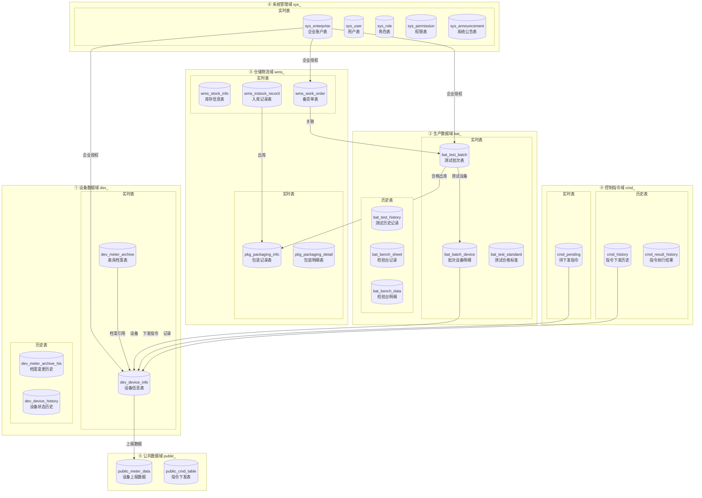

#### 3.3.2 实时表清单

实时表指需要高频更新、查询频率高的业务表，数据存储在MySQL主库，采用分库分表策略。

**① 设备数据域实时表**

| 表名 | 表说明 | 数据特征 | 分片策略 | 保留周期 |
|------|--------|----------|----------|----------|
| dev_meter_archive | 表具档案表 | 低频变更，基础数据 | 单表 | 永久 |
| dev_device_info | 设备信息表 | 高频变更，实时状态 | enterprise_id分片 | 永久 |

**② 生产数据域实时表**

| 表名 | 表说明 | 数据特征 | 分片策略 | 保留周期 |
|------|--------|----------|----------|----------|
| bat_test_batch | 测试批次表 | 中频变更，批次状态 | batch_no哈希 | 6个月 |
| bat_batch_device | 批次设备明细 | 高频变更，测试进度 | batch_id分片 | 6个月 |
| bat_test_standard | 测试合格标准 | 低频变更 | batch_id分片 | 6个月 |

**③ 仓储物流域实时表**

| 表名 | 表说明 | 数据特征 | 分片策略 | 保留周期 |
|------|--------|----------|----------|----------|
| wms_stock_info | 库存信息表 | 高频变更，实时库存 | enterprise_id分片 | 永久 |
| wms_instock_record | 入库记录表 | 中频变更 | enterprise_id分片 | 2年 |
| wms_work_order | 备货单表 | 中频变更 | wo_no分片 | 2年 |
| pkg_packaging_info | 包装记录表 | 中频变更 | wo_no分片 | 2年 |
| pkg_packaging_detail | 包装明细表 | 中频变更 | wo_no分片 | 2年 |

**④ 控制指令域实时表**

| 表名 | 表说明 | 数据特征 | 分片策略 | 保留周期 |
|------|--------|----------|----------|----------|
| cmd_pending | 待下发指令表 | 高频变更，指令队列 | meter_no分片 | 7天 |

**⑥ 系统管理域实时表**

| 表名 | 表说明 | 数据特征 | 分片策略 | 保留周期 |
|------|--------|----------|----------|----------|
| sys_enterprise | 企业账户表 | 低频变更 | 单表 | 永久 |
| sys_user | 用户表 | 低频变更 | 单表 | 永久 |
| sys_role | 角色表 | 低频变更 | 单表 | 永久 |
| sys_permission | 权限表 | 低频变更 | 单表 | 永久 |
| sys_announcement | 系统公告表 | 低频变更 | 单表 | 1年 |

#### 3.3.3 历史表清单

历史表指数据量大、查询频率低的归档数据，存储在MySQL归档库，按时间分表。

**① 设备数据域历史表**

| 表名 | 表说明 | 数据来源 | 分表策略 | 保留周期 |
|------|--------|----------|----------|----------|
| dev_meter_archive_his | 档案变更历史 | dev_meter_archive | 按年分表 | 永久 |
| dev_device_history_* | 设备状态历史 | dev_device_info | 按月分表 | 3年 |

**② 生产数据域历史表**

| 表名 | 表说明 | 数据来源 | 分表策略 | 保留周期 |
|------|--------|----------|----------|----------|
| bat_test_history | 测试历史记录 | bat_test_batch | 按月分表 | 3年 |
| bat_bench_sheet | 检验台记录 | 导入Excel | 按月分表 | 2年 |
| bat_bench_data | 检验台数据明细 | bat_bench_sheet | 按月分表 | 2年 |

**④ 控制指令域历史表**

| 表名 | 表说明 | 数据来源 | 分表策略 | 保留周期 |
|------|--------|----------|----------|----------|
| cmd_history | 指令下发历史 | 业务操作 | 按月分表 | 1年 |
| cmd_result_history | 指令执行结果 | 设备响应 | 按月分表 | 1年 |

#### 3.3.4 ⑤ 公共数据域（外协方提供）

公共数据域由外协方提供，存储在独立的公共数据库中，不属于本系统管理范围。

| 表名 | 表说明 | 数据流向 | 保留周期 | 管理方 |
|------|--------|----------|----------|--------|
| public_meter_data | 设备上报数据 | 物联网平台→公共库→本系统 | 15天 | 外协方 |
| public_cmd_table | 指令下发表 | 本系统→公共库→物联网平台 | 7天 | 外协方 |

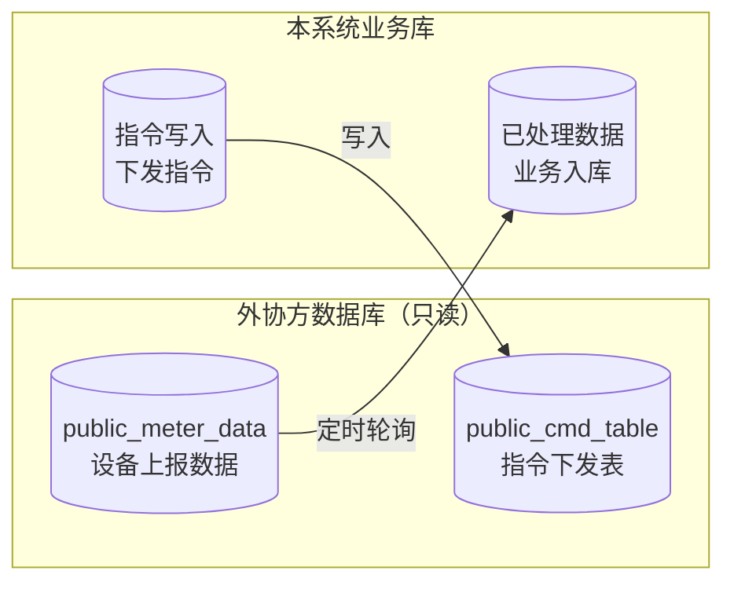

#### 3.3.5 数据生命周期管理

**各数据域数据生命周期**

| 数据域 | 数据类型 | 热数据期 | 温数据期 | 冷数据期 | 处理策略 |
|--------|----------|----------|----------|----------|----------|
| 设备数据域 | 设备实时状态 | 实时 | - | - | 内存缓存加速 |
| 设备数据域 | 设备历史状态 | 0-15天 | 15天-1年 | 1年-3年 | 自动归档 |
| 生产数据域 | 测试批次数据 | 批次周期 | 批次结束-6月 | 6月-3年 | 批次完结后归档 |
| 仓储物流域 | 包装记录 | 包装期间 | 出库-2年 | 2年后 | 定时清理 |
| 控制指令域 | 指令记录 | 0-7天 | 7天-1年 | - | 自动清理 |
| 公共数据域 | 公共库数据 | 0-15天 | - | - | 外协方管理 |

**数据存储层级对照**

| 存储层级 | 存储类型 | 说明 |
|----------|----------|------|
| MySQL主库 | 实时表 | 高频更新的业务数据 |
| MySQL从库 | 查询库 | 读操作分离，减轻主库压力 |
| MySQL归档库 | 历史表 | 归档数据，按时间分表 |
| 公共数据库 | 只读数据 | 外协方提供的共享数据 |
| Redis缓存 | 热点数据 | 高频访问的数据缓存 |

### 3.4 边界约束设计

#### 3.4.1 数据规模约束

**设备规模约束**

| 约束项 | 约束值 | 说明 |
|--------|--------|------|
| 最大设备总量 | 500,000台 | 系统设计的最大设备容量 |
| 单批次最大设备数 | 50,000台 | 单个测试批次支持的最大设备数量 |
| 单企业最大设备数 | 100,000台 | 单个企业账户绑定的最大设备数量 |
| 单备货单最大设备数 | 20,000台 | 单个备货单包含的最大设备数量 |

**数据规模约束**

| 约束项 | 约束值 | 说明 |
|--------|--------|------|
| 日增数据上限 | 500万条 | 每日允许的最大数据增量 |
| 单表最大行数 | 1亿行 | 物理分表的最大行数限制 |
| 单次查询超时 | 30秒 | 数据库查询的最大响应时间 |
| 单次导入上限 | 2,000行 | Excel导入检验台数据的最大行数 |
| 历史数据保留 | 3年 | 业务数据的最长保留周期 |

**并发约束**

| 约束项 | 约束值 | 说明 |
|--------|--------|------|
| 最大并发用户数 | 500人 | 系统支持的最大在线用户数 |
| API并发上限 | 1,000 TPS | 接口每秒最大请求数 |
| 批量操作批次 | 100批次 | 单次批量操作的最大批次数量 |
| 消息队列深度 | 10万条 | RabbitMQ单个队列的最大积压 |

#### 3.4.2 业务规则约束

**备货单约束**

| 约束编号 | 约束规则 | 约束说明 |
|----------|----------|----------|
| WO-001 | 备货单号格式 | 格式：WO-YYYYMMDD-序号，如WO-20260320-001 |
| WO-002 | 单日序号重置 | 每日序号从001开始重置 |
| WO-003 | 备货单状态 | 状态流转：创建→测试中→已完成→已出库 |
| WO-004 | 备货单设备上限 | 单个备货单最多绑定20,000台设备 |
| WO-005 | 备货单关闭条件 | 必须所有设备完成测试并合格才能关闭 |

**批次测试约束**

| 约束编号 | 约束规则 | 约束说明 |
|----------|----------|----------|
| BAT-001 | 批号格式 | 格式：BATCH-YYYYMMDD-序号，如BATCH-20260320-001 |
| BAT-002 | 批次设备上限 | 单批次最多50,000台设备 |
| BAT-003 | 测试前置条件 | 设备必须处于“在库”状态才能加入测试批次 |
| BAT-004 | 合格判定规则 | 所有测试项通过且设备响应成功才判定合格 |
| BAT-005 | 重测限制 | 单台设备同一测试项最多重测3次 |
| BAT-006 | 批次并行限制 | 同一备货单下最多同时存在3个进行中的测试批次 |

**设备入库约束**

| 约束编号 | 约束规则 | 约束说明 |
|----------|----------|----------|
| DEV-001 | 表号唯一性 | 水表表号（meter_no）全局唯一，不可重复 |
| DEV-002 | IMEI唯一性 | IMEI码全局唯一，不可重复 |
| DEV-003 | ICCID唯一性 | ICCID卡号全局唯一，不可重复 |
| DEV-004 | 表号格式 | 水表表号为14位数字编码 |
| DEV-005 | IMEI格式 | IMEI为15位数字编码 |
| DEV-006 | ICCID格式 | ICCID为20位数字编码 |
| DEV-007 | 出库设备锁定 | 已出库设备不允许修改和删除 |
| DEV-008 | 企业绑定 | 设备必须绑定到具体企业才能进行业务操作 |

**包装出库约束**

| 约束编号 | 约束规则 | 约束说明 |
|----------|----------|----------|
| PKG-001 | 箱号格式 | 格式：BOX-YYYYMMDD-序号，如BOX-20260320-001 |
| PKG-002 | 单箱设备上限 | 单箱最多装入100台水表 |
| PKG-003 | 包装前置条件 | 只有测试合格的设备才能进行包装 |
| PKG-004 | 设备唯一包装 | 已包装设备不允许再次包装 |
| PKG-005 | 箱内设备验证 | 封箱前需验证所有绑定设备的状态一致性 |
| PKG-006 | 出库状态更新 | 执行出库操作后，设备库存状态自动更新为“已出库” |

**检验台数据约束**

| 约束编号 | 约束规则 | 约束说明 |
|----------|----------|----------|
| BENCH-001 | 文件格式限制 | 仅支持.xlsx和.xls格式的Excel文件 |
| BENCH-002 | 文件大小限制 | 单个Excel文件不超过10MB |
| BENCH-003 | 数据行数限制 | 单次导入最多2,000行数据 |
| BENCH-004 | 必填字段验证 | 表号(meter_no)为必填项，不能为空 |
| BENCH-005 | 数据类型验证 | 流量、误差等数值字段必须为数字类型 |
| BENCH-006 | 重复数据处理 | 相同表号的多条记录以最后一条为准 |

#### 3.4.3 协议约束

**SR协议约束**

| 约束编号 | 约束规则 | 约束说明 |
|----------|----------|----------|
| SR-001 | 协议版本 | 支持SR协议V1.1.2版本 |
| SR-002 | 通讯方式 | 支持Cat1和NB-IoT双模通信 |
| SR-003 | 心跳间隔 | 默认上报间隔可配置，范围30秒-24小时 |
| SR-004 | 重试机制 | 指令下发失败后自动重试3次 |
| SR-005 | 超时时间 | 指令下发后等待设备响应的超时时间为30秒 |

**恩乐曼协议约束**

| 约束编号 | 约束规则 | 约束说明 |
|----------|----------|----------|
| EN-001 | 协议版本 | 支持恩乐曼协议V2.0.0版本 |
| EN-002 | 通讯方式 | NB-IoT透传模式 |
| EN-003 | 数据格式 | JSON透传格式，协议服务负责解析 |
| EN-004 | 编码格式 | UTF-8编码 |

**CJT188协议约束**

| 约束编号 | 约束规则 | 约束说明 |
|----------|----------|----------|
| CJT-001 | 协议版本 | 支持CJT188-2004国标版本 |
| CJT-002 | 通讯方式 | Cat1网络传输 |
| CJT-003 | 数据域 | 支持0x90、0x91、0x92等功能码 |
| CJT-004 | 校验方式 | CRC16校验 |

#### 3.4.4 性能约束

**响应时间约束**

| 约束项 | 目标值 | 最大值 | 说明 |
|--------|--------|--------|------|
| 列表查询响应 | <500ms | 1s | 分页列表查询 |
| 详情查询响应 | <200ms | 500ms | 单条记录查询 |
| 新增操作响应 | <300ms | 1s | 单条数据新增 |
| 批量导入响应 | <10s | 30s | 2000行数据导入 |
| 批量测试提交 | <2s | 5s | 10000台设备指令下发 |
| 实时数据轮询 | <3s | - | 批量测试页数据刷新 |

**资源使用约束**

| 约束项 | 约束值 | 说明 |
|--------|--------|------|
| CPU使用率 | <80% | 正常运行时CPU峰值 |
| 内存使用率 | <85% | JVM堆内存使用上限 |
| 数据库连接池 | 50-200 | HikariCP连接池大小 |
| Redis内存 | <70% | 最大内存使用比例 |
| MQ消费能力 | 5000条/秒 | 单消费者最大消费速度 |

#### 3.4.5 安全约束

**认证授权约束**

| 约束编号 | 约束规则 | 约束说明 |
|----------|----------|----------|
| AUTH-001 | Token有效期 | OAuth2访问令牌有效期2小时 |
| AUTH-002 | RefreshToken | 刷新令牌有效期7天 |
| AUTH-003 | 密码策略 | 至少8位，包含大小写字母和数字 |
| AUTH-004 | 登录失败锁定 | 连续5次失败锁定账号15分钟 |
| AUTH-005 | 敏感数据加密 | IMEI、ICCID等敏感字段AES加密存储 |

**权限控制约束**

| 约束编号 | 约束规则 | 约束说明 |
|----------|----------|----------|
| PERM-001 | 权限粒度 | 支持按钮级别权限控制 |
| PERM-002 | 角色继承 | 支持角色层级继承 |
| PERM-003 | 数据隔离 | 企业间数据完全隔离 |
| PERM-004 | 操作审计 | 所有数据变更操作记录审计日志 |

#### 3.4.6 可用性约束

**服务可用性约束**

| 约束项 | 目标值 | 说明 |
|--------|--------|------|
| 系统可用性 | ≥99.9% | 年度服务可用时间占比 |
| 单次故障恢复 | <30分钟 | MTTR目标值 |
| 数据备份周期 | 每日全量 | 每日凌晨2点执行全量备份 |
| 备份保留周期 | 30天 | 本地备份保留30天 |
| 异地备份 | 每周 | 每周执行一次异地备份 |

**容灾约束**

| 约束项 | 约束值 | 说明 |
|--------|--------|------|
| 数据库主从 | 1主2从 | 主库故障自动切换从库 |
| Redis集群 | 3主3从 | Redis Cluster模式部署 |
| MQ集群 | 3节点 | RabbitMQ集群部署 |
| 应用服务 | 2+2 | 至少2个应用实例+2个备用实例 |

---

## 第四章 核心模块详细设计

### 4.1 表具档案管理模块

#### 4.1.1 模块职责

表具档案模块是整个生产测试系统的基础数据模块，负责维护智能水表的基础信息档案。档案信息被仓库管理、批次管理、批量测试和包装管理等模块共同引用，确保全系统表具信息的口径统一。

#### 4.1.2 核心类设计

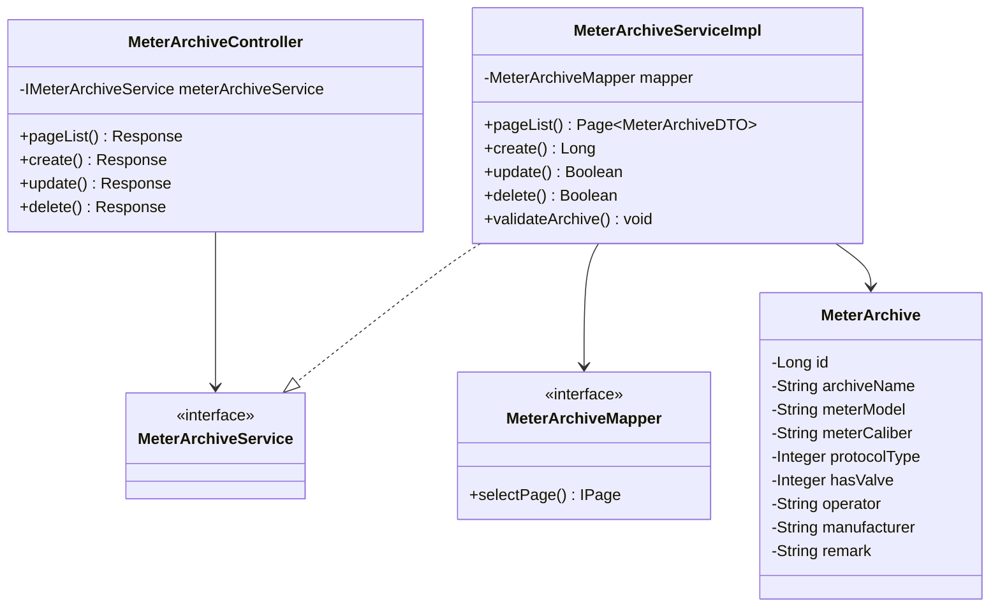

#### 4.1.3 核心代码实现

**MeterArchiveController.java**

```java
@RestController
@RequestMapping("/api/archives")
@Api(tags = "表具档案管理")
@Slf4j
public class MeterArchiveController {

    @Resource
    private IMeterArchiveService meterArchiveService;

    @GetMapping
    @ApiOperation(value = "分页查询表具档案列表")
    @ApiImplicitParams({
        @ApiImplicitParam(name = "keyword", value = "关键字搜索", dataType = "string", paramType = "query"),
        @ApiImplicitParam(name = "pageNum", value = "页码", dataType = "int", paramType = "query", defaultValue = "1"),
        @ApiImplicitParam(name = "pageSize", value = "每页数量", dataType = "int", paramType = "query", defaultValue = "10")
    })
    public Response<Page<MeterArchiveDTO>> pageList(
            @RequestParam(required = false) String keyword,
            @RequestParam(defaultValue = "1") Integer pageNum,
            @RequestParam(defaultValue = "10") Integer pageSize) {
        Page<MeterArchiveDTO> page = meterArchiveService.pageList(keyword, pageNum, pageSize);
        return Response.success(page);
    }

    @PostMapping
    @ApiOperation(value = "新增表具档案")
    @RequiresPermissions("archive:add")
    public Response<Long> create(@RequestBody @Valid MeterArchiveCreateDTO dto) {
        Long id = meterArchiveService.create(dto);
        return Response.success(id);
    }

    @PutMapping("/{id}")
    @ApiOperation(value = "更新表具档案")
    @RequiresPermissions("archive:edit")
    public Response<Boolean> update(@PathVariable Long id, @RequestBody @Valid MeterArchiveUpdateDTO dto) {
        Boolean result = meterArchiveService.update(id, dto);
        return Response.success(result);
    }

    @DeleteMapping("/{id}")
    @ApiOperation(value = "删除表具档案")
    @RequiresPermissions("archive:delete")
    public Response<Boolean> delete(@PathVariable Long id) {
        Boolean result = meterArchiveService.delete(id);
        return Response.success(result);
    }
}
```

**MeterArchiveServiceImpl.java**

```java
@Service
@Slf4j
public class MeterArchiveServiceImpl implements IMeterArchiveService {

    @Resource
    private MeterArchiveMapper meterArchiveMapper;

    @Resource
    private MeterArchiveConverter converter;

    @Transactional(rollbackFor = Exception.class)
    @Override
    public Long create(MeterArchiveCreateDTO dto) {
        // 校验表具型号枚举值
        validateMeterModel(dto.getMeterModel());

        // 校验通讯协议枚举值
        validateProtocolType(dto.getProtocolType());

        // 校验阀门状态枚举值
        validateHasValve(dto.getHasValve());

        // 校验运营商枚举值
        validateOperator(dto.getOperator());

        // 转换并保存
        MeterArchive archive = converter.toEntity(dto);
        archive.preInsert();
        meterArchiveMapper.insert(archive);

        log.info("新增表具档案成功，ID：{}，名称：{}", archive.getId(), archive.getArchiveName());
        return archive.getId();
    }

    @Transactional(rollbackFor = Exception.class)
    @Override
    public Boolean update(Long id, MeterArchiveUpdateDTO dto) {
        MeterArchive archive = meterArchiveMapper.selectById(id);
        if (archive == null) {
            throw new BusinessException("表具档案不存在");
        }

        // 更新字段
        BeanUtils.copyProperties(dto, archive);
        archive.preUpdate();

        return meterArchiveMapper.updateById(archive) > 0;
    }

    @Transactional(rollbackFor = Exception.class)
    @Override
    public Boolean delete(Long id) {
        // 检查是否被设备引用
        Long deviceCount = deviceService.countByArchiveId(id);
        if (deviceCount > 0) {
            throw new BusinessException("该档案已被设备引用，无法删除");
        }

        return meterArchiveMapper.deleteById(id) > 0;
    }

    @Override
    public Page<MeterArchiveDTO> pageList(String keyword, Integer pageNum, Integer pageSize) {
        Page<MeterArchive> page = new Page<>(pageNum, pageSize);
        LambdaQueryWrapper<MeterArchive> wrapper = new LambdaQueryWrapper<>();

        if (StrUtil.isNotBlank(keyword)) {
            wrapper.and(w -> w
                .like(MeterArchive::getArchiveName, keyword)
                .or()
                .like(MeterArchive::getMeterModel, keyword)
                .or()
                .like(MeterArchive::getMeterCaliber, keyword)
                .or()
                .like(MeterArchive::getProtocolType, keyword)
                .or()
                .like(MeterArchive::getOperator, keyword)
                .or()
                .like(MeterArchive::getManufacturer, keyword)
            );
        }

        wrapper.orderByDesc(MeterArchive::getCreateTime);

        Page<MeterArchive> result = meterArchiveMapper.selectPage(page, wrapper);
        return converter.toPageDTO(result);
    }

    private void validateProtocolType(Integer protocolType) {
        if (protocolType == null) {
            throw new BusinessException("通讯协议类型不能为空");
        }
        List<Integer> validTypes = Arrays.asList(1, 2, 3);
        if (!validTypes.contains(protocolType)) {
            throw new BusinessException("通讯协议类型无效，支持：1-SR协议，2-恩乐曼，3-CJT188");
        }
    }

    private void validateMeterModel(String meterModel) {
        List<String> validModels = Arrays.asList("LXSG-15", "LXSG-20", "LXSG-25", "WS-15A");
        if (!validModels.contains(meterModel)) {
            throw new BusinessException("表具型号无效，支持：" + String.join("、", validModels));
        }
    }
}
```

### 4.2 仓库管理模块

#### 4.2.1 模块职责

仓库管理模块负责设备入库、出库和库存状态的全生命周期管理。模块支持扫码入库、批量导入等高效录入方式，同时记录设备的多维度状态信息，为后续测试和追溯提供数据基础。

#### 4.2.2 核心业务流程

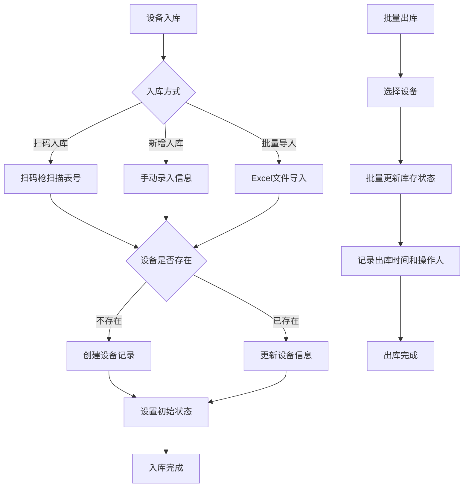

#### 4.2.3 核心代码实现

**DeviceServiceImpl.java**

```java
@Service
@Slf4j
public class DeviceServiceImpl implements IDeviceService {

    @Resource
    private DeviceInfoMapper deviceInfoMapper;

    @Resource
    private BatchImportExecutor batchImportExecutor;

    @Transactional(rollbackFor = Exception.class)
    @Override
    public DeviceCreateDTO create(DeviceCreateDTO dto) {
        // 校验水表表号唯一性
        Long existCount = deviceInfoMapper.selectCount(
            new LambdaQueryWrapper<DeviceInfo>()
                .eq(DeviceInfo::getMeterNo, dto.getMeterNo())
        );
        if (existCount > 0) {
            throw new BusinessException("水表表号已存在：" + dto.getMeterNo());
        }

        // 校验表号格式（14位数字）
        if (!Pattern.matches("^\\d{14}$", dto.getMeterNo())) {
            throw new BusinessException("水表表号必须为14位数字");
        }

        // 校验IMEI格式（15位数字）
        if (StrUtil.isNotBlank(dto.getImei())
            && !Pattern.matches("^\\d{15}$", dto.getImei())) {
            throw new BusinessException("IMEI码必须为15位数字");
        }

        // 转换并保存
        DeviceInfo device = converter.toEntity(dto);
        device.preInsert();

        // 设置初始状态
        device.setInventoryStatus(0);  // 在库
        device.setTestStatus(0);      // 待测
        device.setValveStatus(0);     // 阀门关

        deviceInfoMapper.insert(device);

        log.info("设备入库成功，表号：{}，IMEI：{}", dto.getMeterNo(), dto.getImei());
        return converter.toDTO(device);
    }

    @Transactional(rollbackFor = Exception.class)
    @Override
    public void batchImport(MultipartFile file) {
        // 校验文件类型
        String fileName = file.getOriginalFilename();
        if (fileName == null || (!fileName.endsWith(".xlsx") && !fileName.endsWith(".xls"))) {
            throw new BusinessException("仅支持Excel文件格式（.xlsx/.xls）");
        }

        // 使用线程池异步处理大文件
        batchImportExecutor.execute(file, taskId -> {
            log.info("开始处理批量导入任务，任务ID：{}", taskId);
            // 处理逻辑在BatchImportExecutor中实现
        });
    }

    @Transactional(rollbackFor = Exception.class)
    @Override
    public void batchOutbound(BatchOutboundDTO dto) {
        if (CollectionUtils.isEmpty(dto.getDeviceIds())) {
            throw new BusinessException("请选择要出库的设备");
        }

        String operator = SecurityUtils.getUsername();

        for (Long deviceId : dto.getDeviceIds()) {
            DeviceInfo device = deviceInfoMapper.selectById(deviceId);
            if (device == null) {
                log.warn("设备不存在，ID：{}", deviceId);
                continue;
            }

            if (device.getInventoryStatus() != 0) {
                throw new BusinessException("设备不是库存状态，无法出库：" + device.getMeterNo());
            }

            device.setInventoryStatus(1);  // 已出库
            device.setOutboundTime(new Date());
            device.setOutboundOperator(operator);
            device.preUpdate();

            deviceInfoMapper.updateById(device);
        }

        log.info("批量出库完成，数量：{}，操作人：{}", dto.getDeviceIds().size(), operator);
    }

    @Override
    public WarehouseStatisticsDTO getStatistics() {
        WarehouseStatisticsDTO stats = new WarehouseStatisticsDTO();

        // 统计在库设备数量
        stats.setInStockCount(deviceInfoMapper.selectCount(
            new LambdaQueryWrapper<DeviceInfo>()
                .eq(DeviceInfo::getInventoryStatus, 0)
        ));

        // 统计已出库数量
        stats.setOutboundCount(deviceInfoMapper.selectCount(
            new LambdaQueryWrapper<DeviceInfo>()
                .eq(DeviceInfo::getInventoryStatus, 1)
        ));

        // 统计待测数量
        stats.setPendingTestCount(deviceInfoMapper.selectCount(
            new LambdaQueryWrapper<DeviceInfo>()
                .eq(DeviceInfo::getTestStatus, 0)
                .eq(DeviceInfo::getInventoryStatus, 0)
        ));

        // 统计不合格数量
        stats.setFailedCount(deviceInfoMapper.selectCount(
            new LambdaQueryWrapper<DeviceInfo>()
                .eq(DeviceInfo::getTestStatus, 2)
        ));

        return stats;
    }
}
```

### 4.3 批次管理模块

#### 4.3.1 模块职责

批次管理模块负责组织和管理测试批次，核心功能包括批次创建、备货单号管理、设备分配和测试进度跟踪。批次是批量测试和包装管理的基础组织单元。

#### 4.3.2 编号生成规则

| 编号类型 | 格式 | 示例 | 生成规则 |
|----------|------|------|----------|
| 测试批号 | BATCH-YYYYMMDD-序号 | BATCH-20260320-001 | 日期+当日序号 |
| 备货单号 | WO-YYYYMMDD-序号 | WO-20260320-001 | 日期+当日序号 |

#### 4.3.3 核心代码实现

**BatchServiceImpl.java**

```java
@Service
@Slf4j
public class BatchServiceImpl implements IBatchService {

    @Resource
    private TestBatchMapper batchMapper;

    @Resource
    private BatchDeviceMapper batchDeviceMapper;

    @Resource
    private DeviceInfoMapper deviceInfoMapper;

    @Resource
    private IdGenerator idGenerator;

    @Transactional(rollbackFor = Exception.class)
    @Override
    public TestBatchDTO createBatch(BatchCreateDTO dto) {
        // 生成测试批号
        String batchNo = idGenerator.generateBatchNo();

        // 校验表具档案是否存在
        MeterArchive archive = archiveService.getById(dto.getArchiveId());
        if (archive == null) {
            throw new BusinessException("表具档案不存在");
        }

        // 构建批次实体
        TestBatch batch = new TestBatch();
        batch.setBatchNo(batchNo);
        batch.setWoNo(dto.getWoNo());
        batch.setArchiveId(dto.getArchiveId());
        batch.setEnterpriseId(dto.getEnterpriseId());
        batch.setRemark(dto.getRemark());
        batch.setTotalCount(0);
        batch.setPassCount(0);
        batch.setFailCount(0);
        batch.setPendingCount(0);
        batch.setStatus(0);
        batch.preInsert();

        batchMapper.insert(batch);

        log.info("创建测试批次成功，批号：{}，备货单号：{}", batchNo, dto.getWoNo());
        return converter.toDTO(batch);
    }

    @Transactional(rollbackFor = Exception.class)
    @Override
    public void addDeviceToBatch(Long batchId, Long deviceId) {
        TestBatch batch = batchMapper.selectById(batchId);
        if (batch == null) {
            throw new BusinessException("批次不存在");
        }

        DeviceInfo device = deviceInfoMapper.selectById(deviceId);
        if (device == null) {
            throw new BusinessException("设备不存在");
        }

        // 检查设备是否已在该批次中
        Long existCount = batchDeviceMapper.selectCount(
            new LambdaQueryWrapper<BatchDevice>()
                .eq(BatchDevice::getBatchId, batchId)
                .eq(BatchDevice::getDeviceId, deviceId)
        );
        if (existCount > 0) {
            throw new BusinessException("设备已在该批次中");
        }

        // 添加到批次
        BatchDevice batchDevice = new BatchDevice();
        batchDevice.setBatchId(batchId);
        batchDevice.setDeviceId(deviceId);
        batchDevice.setMeterNo(device.getMeterNo());
        batchDevice.setTestStatus(0);  // 待测试
        batchDevice.setJudgeStatus("pending");
        batchDevice.preInsert();

        batchDeviceMapper.insert(batchDevice);

        // 更新批次统计
        updateBatchStatistics(batchId);

        log.info("设备添加到批次成功，批号：{}，表号：{}", batch.getBatchNo(), device.getMeterNo());
    }

    @Transactional(rollbackFor = Exception.class)
    @Override
    public void updateWoNo(String oldWoNo, String newWoNo) {
        if (StrUtil.equals(oldWoNo, newWoNo)) {
            return;
        }

        // 查询使用该备货单号的所有批次
        List<TestBatch> batches = batchMapper.selectList(
            new LambdaQueryWrapper<TestBatch>()
                .eq(TestBatch::getWoNo, oldWoNo)
        );

        if (CollectionUtils.isEmpty(batches)) {
            throw new BusinessException("未找到使用该备货单号的批次");
        }

        // 批量更新备货单号
        for (TestBatch batch : batches) {
            batch.setWoNo(newWoNo);
            batch.preUpdate();
            batchMapper.updateById(batch);
        }

        log.info("批量更新备货单号完成，旧单号：{}，新单号：{}，更新批次数：{}",
            oldWoNo, newWoNo, batches.size());
    }

    private void updateBatchStatistics(Long batchId) {
        TestBatch batch = batchMapper.selectById(batchId);

        // 统计各状态数量
        Long total = batchDeviceMapper.selectCount(
            new LambdaQueryWrapper<BatchDevice>().eq(BatchDevice::getBatchId, batchId));
        Long pass = batchDeviceMapper.selectCount(
            new LambdaQueryWrapper<BatchDevice>()
                .eq(BatchDevice::getBatchId, batchId)
                .eq(BatchDevice::getJudgeStatus, "passed"));
        Long fail = batchDeviceMapper.selectCount(
            new LambdaQueryWrapper<BatchDevice>()
                .eq(BatchDevice::getBatchId, batchId)
                .eq(BatchDevice::getJudgeStatus, "failed"));
        Long pending = batchDeviceMapper.selectCount(
            new LambdaQueryWrapper<BatchDevice>()
                .eq(BatchDevice::getBatchId, batchId)
                .eq(BatchDevice::getJudgeStatus, "pending"));

        batch.setTotalCount(total.intValue());
        batch.setPassCount(pass.intValue());
        batch.setFailCount(fail.intValue());
        batch.setPendingCount(pending.intValue());
        batch.preUpdate();

        batchMapper.updateById(batch);
    }
}
```

### 4.4 批量测试模块

#### 4.4.1 模块职责

批量测试模块是生产测试系统的核心模块，负责执行智能水表的批量测试任务。模块支持多种测试动作（开阀、关阀，写表底，写表号等），实时展示测试状态和结果，并支持保存测试历史快照。

#### 4.4.2 测试动作定义

| 动作名称 | 指令类型 | 说明 | 输入参数 |
|----------|----------|------|----------|
| 数据上报 | REPORT | 触发设备上报数据 | 无 |
| 开阀 | OPEN_VALVE | 打开设备阀门 | 无 |
| 关阀 | CLOSE_VALVE | 关闭设备阀门 | 无 |
| 写表底 | WRITE_METER_READING | 写入表底数 | 表底值 |
| 写表号 | WRITE_METER_NO | 修改表号 | 新表号 |
| 读取上报周期 | READ_REPORT_INTERVAL | 读取上报间隔 | 无 |
| 设置上报周期 | SET_REPORT_INTERVAL | 设置上报间隔 | 上报周期（秒） |
| 读取IP地址 | READ_IP | 读取主备IP | 无 |
| 写IP地址 | WRITE_IP | 写入主备IP | 主IP、副IP |
| 程序升级 | UPGRADE | 远程升级程序 | 升级包URL |
| 查看原始数据 | VIEW_RAW_DATA | 查看原始协议数据 | 无 |
| 写表时间 | WRITE_TIME | 校准设备时间 | 无 |
| 批量合格 | BATCH_PASS | 标记设备合格 | 无 |
| 保存历史 | SAVE_HISTORY | 保存测试快照 | 无 |

#### 4.4.3 核心代码实现

**BatchTestServiceImpl.java**

```java
@Service
@Slf4j
public class BatchTestServiceImpl implements IBatchTestService {

    @Resource
    private TestBatchMapper batchMapper;

    @Resource
    private BatchDeviceMapper batchDeviceMapper;

    @Resource
    private TestHistoryMapper historyMapper;

    @Resource
    private TestStandardMapper standardMapper;

    @Resource
    private RabbitMQTemplate rabbitMQTemplate;

    @Resource
    private TestCommandExecutor commandExecutor;

    @Override
    public void executeBatchAction(Long batchId, String actionType, Map<String, Object> params) {
        TestBatch batch = batchMapper.selectById(batchId);
        if (batch == null) {
            throw new BusinessException("批次不存在");
        }

        // 获取批次下所有待测设备
        List<BatchDevice> devices = batchDeviceMapper.selectList(
            new LambdaQueryWrapper<BatchDevice>()
                .eq(BatchDevice::getBatchId, batchId)
                .eq(BatchDevice::getJudgeStatus, "pending")
        );

        if (CollectionUtils.isEmpty(devices)) {
            throw new BusinessException("批次下没有待测设备");
        }

        log.info("开始执行批量动作，批号：{}，动作：{}，设备数：{}",
            batch.getBatchNo(), actionType, devices.size());

        // 发送异步任务到消息队列
        for (BatchDevice device : devices) {
            TestCommand command = new TestCommand();
            command.setCommandId(IdUtil.fastSimpleUUID());
            command.setBatchId(batchId);
            command.setDeviceId(device.getId());
            command.setMeterNo(device.getMeterNo());
            command.setActionType(actionType);
            command.setParams(params);
            command.setOperator(SecurityUtils.getUsername());
            command.setCreateTime(new Date());

            // 发送到测试命令队列
            rabbitMQTemplate.convertAndSend(
                RabbitMQConstants.TEST_COMMAND_EXCHANGE,
                RabbitMQConstants.TEST_COMMAND_ROUTING_KEY,
                command
            );
        }

        log.info("批量动作任务已发送到消息队列，批号：{}，任务数：{}",
            batch.getBatchNo(), devices.size());
    }

    @Transactional(rollbackFor = Exception.class)
    @Override
    public void saveHistory(Long batchId) {
        TestBatch batch = batchMapper.selectById(batchId);
        if (batch == null) {
            throw new BusinessException("批次不存在");
        }

        // 创建历史快照
        TestHistory history = new TestHistory();
        history.setBatchId(batchId);
        history.setBatchNo(batch.getBatchNo());
        history.setWoNo(batch.getWoNo());
        history.setArchiveId(batch.getArchiveId());
        history.setEnterpriseId(batch.getEnterpriseId());
        history.setTotalCount(batch.getTotalCount());
        history.setPassCount(batch.getPassCount());
        history.setFailCount(batch.getFailCount());
        history.setPendingCount(batch.getPendingCount());

        // 计算合格率
        if (batch.getTotalCount() > 0) {
            history.setPassRate(
                BigDecimal.valueOf(batch.getPassCount())
                    .divide(BigDecimal.valueOf(batch.getTotalCount()), 4, RoundingMode.HALF_UP)
                    .multiply(BigDecimal.valueOf(100))
            );
        } else {
            history.setPassRate(BigDecimal.ZERO);
        }

        history.setTestTime(new Date());
        history.setOperator(SecurityUtils.getUsername());
        history.setRemark(batch.getRemark());
        history.preInsert();

        historyMapper.insert(history);

        // 更新批次状态为已完成
        batch.setStatus(1);
        batch.preUpdate();
        batchMapper.updateById(batch);

        log.info("保存测试历史成功，批号：{}，历史ID：{}", batch.getBatchNo(), history.getId());
    }

    @Override
    public void updateDeviceTestResult(Long batchDeviceId, TestResultDTO result) {
        BatchDevice device = batchDeviceMapper.selectById(batchDeviceId);
        if (device == null) {
            log.warn("批次设备不存在，ID：{}", batchDeviceId);
            return;
        }

        // 更新上报次数
        device.setReportSuccess(result.getSuccessCount() != null ? result.getSuccessCount() : 0);
        device.setReportTotal(result.getTotalCount() != null ? result.getTotalCount() : 0);
        device.setLastReportTime(new Date());

        // 根据测试标准判定结果
        TestStandard standard = standardMapper.selectOne(
            new LambdaQueryWrapper<TestStandard>()
                .eq(TestStandard::getBatchId, device.getBatchId())
        );

        if (standard != null) {
            String judgeStatus = judgeDeviceStatus(result, standard);
            device.setJudgeStatus(judgeStatus);
            device.setTestStatus("passed".equals(judgeStatus) ? 1 :
                                "failed".equals(judgeStatus) ? 2 : 2);
        }

        device.preUpdate();
        batchDeviceMapper.updateById(device);

        // 更新批次统计
        updateBatchStatistics(device.getBatchId());
    }

    private String judgeDeviceStatus(TestResultDTO result, TestStandard standard) {
        // 判定电压
        if (result.getVoltage() != null) {
            if (result.getVoltage().compareTo(standard.getVoltageMin()) < 0
                || result.getVoltage().compareTo(standard.getVoltageMax()) > 0) {
                return "failed";
            }
        }

        // 判定阀门状态
        if (result.getValveStatus() != null && standard.getValveRule() != null) {
            if (!result.getValveStatus().toString().equals(standard.getValveRule())) {
                return "failed";
            }
        }

        // 其他判定逻辑...

        return "passed";
    }
}
```

#### 4.4.4 实时数据轮询

```java
@Component
@Slf4j
public class TestDataPollingTask {

    @Resource
    private TestBatchMapper batchMapper;

    @Resource
    private BatchDeviceMapper batchDeviceMapper;

    @Resource
    private TestResultMapper resultMapper;

    @Resource
    private TestHistoryMapper historyMapper;

    /**
     * 定时轮询公共数据库，获取最新测试数据
     * 默认间隔：3秒
     */
    @Scheduled(fixedDelayString = "${test.polling.interval:3000}")
    @Transactional(rollbackFor = Exception.class)
    public void pollTestData() {
        // 查询所有进行中的批次
        List<TestBatch> activeBatches = batchMapper.selectList(
            new LambdaQueryWrapper<TestBatch>()
                .eq(TestBatch::getStatus, 0)
        );

        if (CollectionUtils.isEmpty(activeBatches)) {
            return;
        }

        for (TestBatch batch : activeBatches) {
            processBatchData(batch);
        }
    }

    private void processBatchData(TestBatch batch) {
        // 查询该批次下未处理的测试记录
        List<TestRecord> records = resultMapper.selectUnprocessedRecords(
            batch.getBatchNo(),
            100  // 每次最多处理100条
        );

        for (TestRecord record : records) {
            try {
                // 解析协议数据
                TestResultDTO result = protocolParser.parse(record);

                // 更新设备状态
                updateDeviceStatus(record.getMeterNo(), result);

                // 标记记录已处理
                resultMapper.markAsProcessed(record.getId());

            } catch (Exception e) {
                log.error("处理测试记录失败，ID：{}，表号：{}", record.getId(), record.getMeterNo(), e);
            }
        }
    }
}
```

### 4.5 包装管理模块

#### 4.5.1 模块职责

包装管理模块负责测试完成后的设备包装，支持三级层级结构（备货单号层、箱号层、单表号层）的管理。模块支持扫码绑定和条码打印功能，与得力打印SDK集成实现标签打印。

#### 4.5.2 三级层级结构

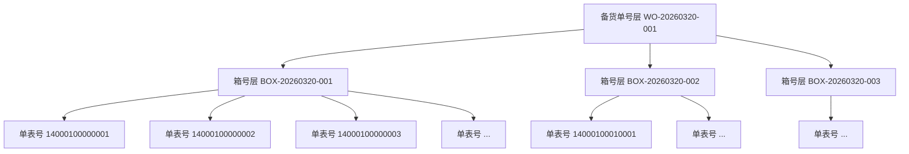

#### 4.5.3 核心代码实现

**PackagingServiceImpl.java**

```java
@Service
@Slf4j
public class PackagingServiceImpl implements IPackagingService {

    @Resource
    private PackagingInfoMapper packagingInfoMapper;

    @Resource
    private PackagingDetailMapper packagingDetailMapper;

    @Resource
    private DeviceInfoMapper deviceInfoMapper;

    @Resource
    private IdGenerator idGenerator;

    @Resource
    private DeliPrintService deliPrintService;

    @Transactional(rollbackFor = Exception.class)
    @Override
    public PackagingDTO createPackaging(PackagingCreateDTO dto) {
        // 生成箱号
        String boxNo = idGenerator.generateBoxNo();

        // 校验表具档案
        MeterArchive archive = archiveService.getById(dto.getArchiveId());
        if (archive == null) {
            throw new BusinessException("表具档案不存在");
        }

        // 构建包装记录
        PackagingInfo packaging = new PackagingInfo();
        packaging.setWoNo(dto.getWoNo());
        packaging.setBoxNo(boxNo);
        packaging.setBoxBarcode(generateBarcode(boxNo));
        packaging.setArchiveId(dto.getArchiveId());
        packaging.setEnterpriseId(dto.getEnterpriseId());
        packaging.setInspector(SecurityUtils.getUsername());
        packaging.setRemark(dto.getRemark());
        packaging.preInsert();

        packagingInfoMapper.insert(packaging);

        log.info("创建包装记录成功，箱号：{}，备货单号：{}", boxNo, dto.getWoNo());
        return converter.toDTO(packaging);
    }

    @Transactional(rollbackFor = Exception.class)
    @Override
    public void bindMeter(Long packagingId, String meterNo) {
        PackagingInfo packaging = packagingInfoMapper.selectById(packagingId);
        if (packaging == null) {
            throw new BusinessException("包装记录不存在");
        }

        // 校验设备
        DeviceInfo device = deviceInfoMapper.selectOne(
            new LambdaQueryWrapper<DeviceInfo>()
                .eq(DeviceInfo::getMeterNo, meterNo)
        );
        if (device == null) {
            throw new BusinessException("设备不存在：" + meterNo);
        }

        // 检查设备是否已包装
        Long existCount = packagingDetailMapper.selectCount(
            new LambdaQueryWrapper<PackagingDetail>()
                .eq(PackagingDetail::getMeterNo, meterNo)
        );
        if (existCount > 0) {
            throw new BusinessException("该设备已被其他箱号绑定：" + meterNo);
        }

        // 绑定设备到包装箱
        PackagingDetail detail = new PackagingDetail();
        detail.setPackagingId(packagingId);
        detail.setDeviceId(device.getId());
        detail.setMeterNo(meterNo);
        detail.preInsert();

        packagingDetailMapper.insert(detail);

        log.info("设备绑定成功，箱号：{}，表号：{}", packaging.getBoxNo(), meterNo);
    }

    @Override
    public void printLabel(Long packagingId) {
        PackagingInfo packaging = packagingInfoMapper.selectById(packagingId);
        if (packaging == null) {
            throw new BusinessException("包装记录不存在");
        }

        // 查询箱内所有设备
        List<PackagingDetail> details = packagingDetailMapper.selectList(
            new LambdaQueryWrapper<PackagingDetail>()
                .eq(PackagingDetail::getPackagingId, packagingId)
        );

        if (CollectionUtils.isEmpty(details)) {
            throw new BusinessException("包装箱内没有设备，无法打印");
        }

        // 获取表具档案信息
        MeterArchive archive = archiveService.getById(packaging.getArchiveId());

        // 构建打印数据
        PrintLabelData labelData = new PrintLabelData();
        labelData.setBoxNo(packaging.getBoxNo());
        labelData.setWoNo(packaging.getWoNo());
        labelData.setMeterCount(details.size());
        labelData.setMeterType(archive != null ? archive.getMeterModel() : "");
        labelData.setMeterCaliber(archive != null ? archive.getMeterCaliber() : "");
        labelData.setInspector(packaging.getInspector());
        labelData.setPackagingTime(packaging.getCreateTime());
        labelData.setMeterNos(details.stream()
            .map(PackagingDetail::getMeterNo)
            .collect(Collectors.toList()));

        // 调用得力打印服务
        PrintResult result = deliPrintService.printLabel(labelData);

        if (!result.isSuccess()) {
            throw new BusinessException("打印失败：" + result.getMessage());
        }

        log.info("标签打印成功，箱号：{}，标签数：{}", packaging.getBoxNo(), details.size());
    }

    @Override
    public List<PackagingTreeDTO> getPackagingTree(String woNo) {
        // 查询该备货单号下所有包装箱
        List<PackagingInfo> packagings = packagingInfoMapper.selectList(
            new LambdaQueryWrapper<PackagingInfo>()
                .eq(PackagingInfo::getWoNo, woNo)
                .orderByAsc(PackagingInfo::getCreateTime)
        );

        List<PackagingTreeDTO> tree = new ArrayList<>();

        for (PackagingInfo packaging : packagings) {
            PackagingTreeDTO node = new PackagingTreeDTO();
            node.setLevel(2);  // 箱号层
            node.setPackagingId(packaging.getId());
            node.setBoxNo(packaging.getBoxNo());
            node.setInspector(packaging.getInspector());
            node.setPackagingTime(packaging.getCreateTime());

            // 查询箱内设备
            List<PackagingDetail> details = packagingDetailMapper.selectList(
                new LambdaQueryWrapper<PackagingDetail>()
                    .eq(PackagingDetail::getPackagingId, packaging.getId())
            );

            for (PackagingDetail detail : details) {
                PackagingTreeDTO child = new PackagingTreeDTO();
                child.setLevel(3);  // 单表号层
                child.setMeterNo(detail.getMeterNo());
                child.setBindTime(detail.getCreateTime());
                node.addChild(child);
            }

            tree.add(node);
        }

        return tree;
    }
}
```

### 4.6 协议解析模块

#### 4.6.1 模块职责

协议解析模块负责解析三种主流水表通信协议（SR协议、恩乐曼协议、CJT188协议）的原始数据，将协议数据转换为统一的业务数据模型，并写入业务数据库。

#### 4.6.2 协议解析器设计

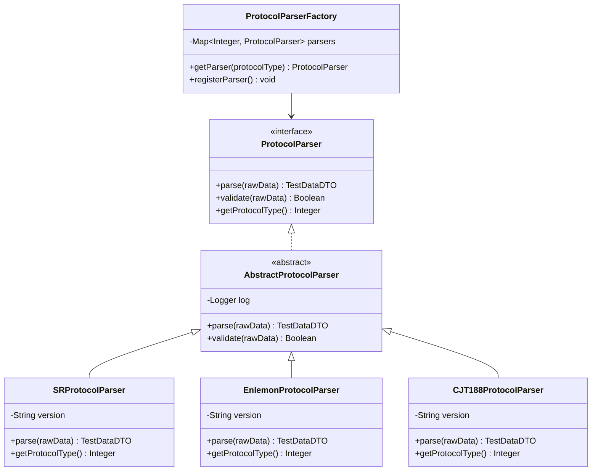

#### 4.6.3 核心代码实现

**SRProtocolParser.java**

```java
@Component
@Slf4j
public class SRProtocolParser extends AbstractProtocolParser {

    @Override
    public Integer getProtocolType() {
        return 1;  // SR协议
    }

    @Override
    public TestDataDTO parse(byte[] rawData) {
        if (!validate(rawData)) {
            throw new ProtocolParseException("SR协议数据校验失败");
        }

        TestDataDTO dto = new TestDataDTO();

        try {
            // 解析表号（字节偏移0-13，共14位）
            String meterNo = parseMeterNo(rawData, 0, 14);
            dto.setMeterNo(meterNo);

            // 解析IMEI（字节偏移14-28，共15位）
            String imei = parseString(rawData, 14, 15);
            dto.setImei(imei);

            // 解析正向累积流量（字节偏移29-36，8位BCD码，3位小数）
            BigDecimal forwardFlow = parseBCD(rawData, 29, 8, 3);
            dto.setForwardFlow(forwardFlow);

            // 解析反向累积流量（字节偏移37-44，8位BCD码，3位小数）
            BigDecimal reverseFlow = parseBCD(rawData, 37, 8, 3);
            dto.setReverseFlow(reverseFlow);

            // 解析阀门状态（字节偏移45，1位）
            int valveStatus = rawData[45] & 0xFF;
            dto.setValveStatus(valveStatus);

            // 解析电池电压（字节偏移46-47，2位BCD码，1位小数）
            BigDecimal voltage = parseBCD(rawData, 46, 2, 1);
            dto.setBatteryVoltage(voltage);

            // 解析CSQ信号强度（字节偏移48，1位）
            int csq = rawData[48] & 0xFF;
            dto.setCsq(csq);

            // 解析RSRP信号功率（字节偏移49-50，2位）
            int rsrp = parseSignedShort(rawData, 49);
            dto.setRsrp(rsrp);

            // 解析RSRQ信号质量（字节偏移51-52，2位）
            int rsrq = parseSignedShort(rawData, 51);
            dto.setRsrq(rsrq);

            // 解析环境温度（字节偏移53-54，2位BCD码，1位小数，负数）
            BigDecimal temperature = parseSignedBCD(rawData, 53, 2, 1);
            dto.setTemperature(temperature);

            // 解析压力（字节偏移55-58，4位BCD码，2位小数）
            BigDecimal pressure = parseBCD(rawData, 55, 4, 2);
            dto.setPressure(pressure);

            // 解析上报时间（字节偏移59-65，7位）
            Date reportTime = parseReportTime(rawData, 59);
            dto.setReportTime(reportTime);

            dto.setParseSuccess(true);
            log.debug("SR协议解析成功，表号：{}", meterNo);

        } catch (Exception e) {
            dto.setParseSuccess(false);
            dto.setErrorMessage(e.getMessage());
            log.error("SR协议解析失败", e);
        }

        return dto;
    }

    @Override
    protected boolean validate(byte[] rawData) {
        if (rawData == null || rawData.length < 66) {
            return false;
        }

        // 校验帧头（0x68）
        if (rawData[0] != 0x68) {
            return false;
        }

        // 校验帧尾（0x16）
        if (rawData[rawData.length - 1] != 0x16) {
            return false;
        }

        // 校验CRC（简单校验）
        byte crc = calculateCRC(rawData, 1, rawData.length - 3);
        return crc == rawData[rawData.length - 2];
    }
}
```

**EnlemonProtocolParser.java**

```java
@Component
@Slf4j
public class EnlemonProtocolParser extends AbstractProtocolParser {

    @Override
    public Integer getProtocolType() {
        return 2;  // 恩乐曼协议
    }

    @Override
    public TestDataDTO parse(byte[] rawData) {
        if (!validate(rawData)) {
            throw new ProtocolParseException("恩乐曼协议数据校验失败");
        }

        TestDataDTO dto = new TestDataDTO();

        try {
            // 恩乐曼协议采用JSON格式透传
            String jsonStr = new String(rawData, StandardCharsets.UTF_8);
            JSONObject json = JSON.parseObject(jsonStr);

            // 解析设备标识
            dto.setMeterNo(json.getString("meterNo"));
            dto.setImei(json.getString("imei"));
            dto.setIccid(json.getString("iccid"));

            // 解析测量数据
            JSONObject data = json.getJSONObject("data");
            if (data != null) {
                dto.setForwardFlow(data.getBigDecimal("forwardFlow"));
                dto.setReverseFlow(data.getBigDecimal("reverseFlow"));
                dto.setValveStatus(data.getInteger("valveStatus"));
                dto.setBatteryVoltage(data.getBigDecimal("voltage"));
                dto.setTemperature(data.getBigDecimal("temperature"));
                dto.setPressure(data.getBigDecimal("pressure"));
            }

            // 解析信号数据
            JSONObject signal = json.getJSONObject("signal");
            if (signal != null) {
                dto.setCsq(signal.getInteger("csq"));
                dto.setRsrp(signal.getInteger("rsrp"));
                dto.setRsrq(signal.getInteger("rsrq"));
            }

            // 解析时间戳
            Long timestamp = json.getLong("timestamp");
            if (timestamp != null) {
                dto.setReportTime(new Date(timestamp));
            }

            dto.setParseSuccess(true);
            log.debug("恩乐曼协议解析成功，表号：{}", dto.getMeterNo());

        } catch (Exception e) {
            dto.setParseSuccess(false);
            dto.setErrorMessage(e.getMessage());
            log.error("恩乐曼协议解析失败", e);
        }

        return dto;
    }
}
```

**CJT188ProtocolParser.java**

```java
@Component
@Slf4j
public class CJT188ProtocolParser extends AbstractProtocolParser {

    @Override
    public Integer getProtocolType() {
        return 3;  // CJT188协议
    }

    @Override
    public TestDataDTO parse(byte[] rawData) {
        if (!validate(rawData)) {
            throw new ProtocolParseException("CJT188协议数据校验失败");
        }

        TestDataDTO dto = new TestDataDTO();

        try {
            // CJT188协议结构：
            // 起始符(1) + 地址(6) + 控制码(1) + 数据长度(1) + 数据(N) + 校验(1) + 结束符(1)

            // 解析地址域（表号，6字节BCD码，12位）
            String meterNo = parseMeterNo(rawData, 1, 12);
            dto.setMeterNo(meterNo);

            // 解析控制码（字节偏移8）
            int controlCode = rawData[8] & 0xFF;
            dto.setControlCode(controlCode);

            // 解析数据长度（字节偏移9）
            int dataLength = rawData[9] & 0xFF;

            // 解析数据域（根据控制码不同，数据域结构不同）
            int dataOffset = 10;

            if (controlCode == 0x90 || controlCode == 0x91) {
                // 读数据响应
                parseReadDataResponse(dto, rawData, dataOffset);
            } else if (controlCode == 0xA0 || controlCode == 0xA1) {
                // 读当前用量
                parseCurrentUsage(dto, rawData, dataOffset);
            }

            dto.setParseSuccess(true);
            log.debug("CJT188协议解析成功，表号：{}", meterNo);

        } catch (Exception e) {
            dto.setParseSuccess(false);
            dto.setErrorMessage(e.getMessage());
            log.error("CJT188协议解析失败", e);
        }

        return dto;
    }

    @Override
    protected boolean validate(byte[] rawData) {
        if (rawData == null || rawData.length < 10) {
            return false;
        }

        // 校验起始符（0xFE）
        if (rawData[0] != 0xFE) {
            return false;
        }

        // 校验结束符（0x16）
        if (rawData[rawData.length - 1] != 0x16) {
            return false;
        }

        // 校验地址域（全0xAA表示无效地址）
        boolean hasValidAddress = false;
        for (int i = 1; i <= 6; i++) {
            if (rawData[i] != (byte) 0xAA) {
                hasValidAddress = true;
                break;
            }
        }

        return hasValidAddress;
    }
}
```

---

## 第五章 接口设计

### 5.1 接口规范

#### 5.1.1 RESTful API规范

| 方法 | 路径 | 说明 | 示例 |
|------|------|------|------|
| GET | /{resource} | 查询列表 | GET /api/archives |
| GET | /{resource}/{id} | 查询详情 | GET /api/archives/1 |
| POST | /{resource} | 新增 | POST /api/archives |
| PUT | /{resource}/{id} | 更新 | PUT /api/archives/1 |
| DELETE | /{resource}/{id} | 删除 | DELETE /api/archives/1 |
| POST | /{resource}/batch | 批量操作 | POST /api/devices/batch |
| POST | /{resource}/import | 导入 | POST /api/devices/import |
| GET | /{resource}/export | 导出 | GET /api/devices/export |

#### 5.1.2 统一响应格式

```java
@Data
public class Response<T> {
    private Integer code;
    private String message;
    private T data;
    private Long timestamp;
    private String requestId;

    public static <T> Response<T> success(T data) {
        Response<T> response = new Response<>();
        response.setCode(200);
        response.setMessage("success");
        response.setData(data);
        response.setTimestamp(System.currentTimeMillis());
        response.setRequestId(UUID.randomUUID().toString());
        return response;
    }

    public static <T> Response<T> fail(String message) {
        Response<T> response = new Response<>();
        response.setCode(500);
        response.setMessage(message);
        response.setTimestamp(System.currentTimeMillis());
        response.setRequestId(UUID.randomUUID().toString());
        return response;
    }
}
```

#### 5.1.3 响应码定义

| 响应码 | 说明 | 使用场景 |
|--------|------|----------|
| 200 | 成功 | 正常业务处理成功 |
| 400 | 请求参数错误 | 参数校验失败、格式错误 |
| 401 | 未认证 | Token无效或过期 |
| 403 | 无权限 | 缺少必要权限 |
| 404 | 资源不存在 | 查询的数据不存在 |
| 409 | 业务冲突 | 数据重复、状态冲突 |
| 500 | 服务器内部错误 | 系统异常 |

### 5.2 核心接口定义

#### 5.2.1 表具档案接口

| 接口路径 | 方法 | 功能说明 | 权限 |
|----------|------|----------|------|
| /api/archives | GET | 分页查询档案列表 | archive:view |
| /api/archives | POST | 新增档案 | archive:add |
| /api/archives/{id} | GET | 查询档案详情 | archive:view |
| /api/archives/{id} | PUT | 更新档案 | archive:edit |
| /api/archives/{id} | DELETE | 删除档案 | archive:delete |

**分页查询档案列表**

```json
// GET /api/archives?keyword=&pageNum=1&pageSize=10

// Response
{
    "code": 200,
    "message": "success",
    "data": {
        "records": [
            {
                "id": 1,
                "archiveName": "NB-IoT有阀水表",
                "meterModel": "LXSG-15",
                "meterCaliber": "DN15",
                "protocolType": 1,
                "protocolName": "SR协议",
                "hasValve": 1,
                "hasValveName": "有阀门",
                "operator": "电信",
                "manufacturer": "测试厂家",
                "remark": "测试备注",
                "createTime": "2026-03-20 10:00:00"
            }
        ],
        "total": 100,
        "size": 10,
        "current": 1,
        "pages": 10
    }
}
```

#### 5.2.2 设备管理接口

| 接口路径 | 方法 | 功能说明 | 权限 |
|----------|------|----------|------|
| /api/devices | GET | 分页查询设备列表 | device:view |
| /api/devices | POST | 新增设备 | device:add |
| /api/devices/{id} | GET | 查询设备详情 | device:view |
| /api/devices/{id} | PUT | 更新设备 | device:edit |
| /api/devices/{id} | DELETE | 删除设备 | device:delete |
| /api/devices/import | POST | 批量导入设备 | device:import |
| /api/devices/outbound | POST | 批量出库 | device:outbound |
| /api/devices/statistics | GET | 获取仓库统计 | device:view |

**批量导入设备**

```json
// POST /api/devices/import
// Content-Type: multipart/form-data
// file: Excel文件

// Response
{
    "code": 200,
    "message": "success",
    "data": {
        "taskId": "uuid-xxx",
        "status": "processing",
        "totalCount": 10000
    }
}
```

#### 5.2.3 批次管理接口

| 接口路径 | 方法 | 功能说明 | 权限 |
|----------|------|----------|------|
| /api/batches | GET | 分页查询批次列表 | batch:view |
| /api/batches | POST | 新增批次 | batch:add |
| /api/batches/{id} | GET | 查询批次详情 | batch:view |
| /api/batches/{id}/devices | POST | 添加设备到批次 | batch:add |
| /api/batches/{id}/action | POST | 执行批量动作 | batch:action |
| /api/batches/{id}/history | POST | 保存测试历史 | batch:history |
| /api/batches/wo-no | PUT | 更新备货单号 | batch:edit |

#### 5.2.4 批量测试接口

| 接口路径 | 方法 | 功能说明 | 权限 |
|----------|------|----------|------|
| /api/test/batches/{batchId}/realtime | GET | 获取实时测试数据 | test:view |
| /api/test/batches/{batchId}/standard | GET | 获取测试标准 | test:view |
| /api/test/batches/{batchId}/standard | PUT | 配置测试标准 | test:config |
| /api/test/devices/{deviceId}/result | GET | 获取设备测试结果 | test:view |

#### 5.2.5 包装管理接口

| 接口路径 | 方法 | 功能说明 | 权限 |
|----------|------|----------|------|
| /api/packaging | GET | 分页查询包装列表 | packaging:view |
| /api/packaging | POST | 新增包装记录 | packaging:add |
| /api/packaging/{id}/bind | POST | 绑定设备 | packaging:bind |
| /api/packaging/{id}/print | POST | 打印标签 | packaging:print |
| /api/packaging/tree | GET | 获取包装树形结构 | packaging:view |

---

## 第六章 安全设计

### 6.1 认证授权

#### 6.1.1 OAuth2认证流程

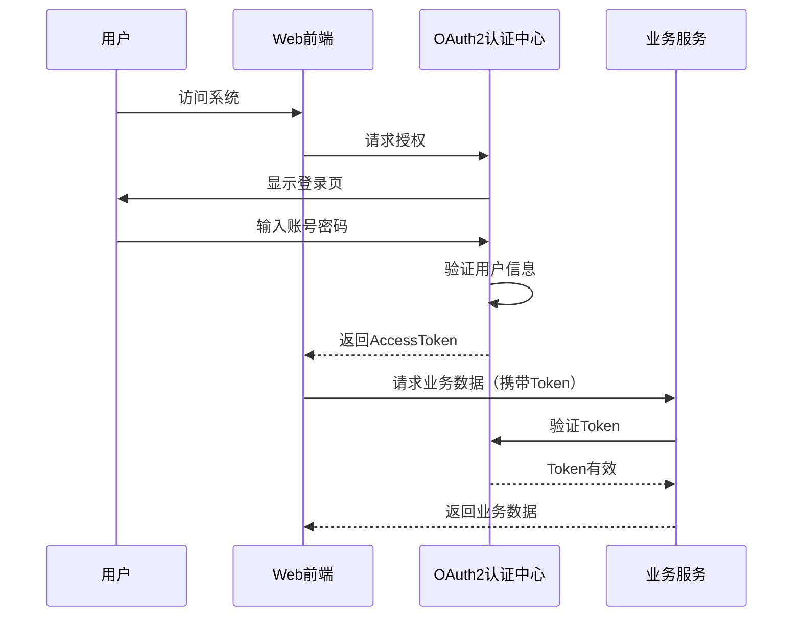

#### 6.1.2 权限控制模型

采用BladeX的RBAC权限控制模型，支持按钮级别的细粒度权限控制：

| 权限标识 | 权限名称 | 所属模块 | 说明 |
|----------|----------|----------|------|
| archive:view | 查看档案 | 表具档案 | 查看列表和详情 |
| archive:add | 新增档案 | 表具档案 | 新增档案记录 |
| archive:edit | 编辑档案 | 表具档案 | 修改档案信息 |
| archive:delete | 删除档案 | 表具档案 | 删除档案记录 |
| device:view | 查看设备 | 仓库管理 | 查看设备列表 |
| device:add | 新增设备 | 仓库管理 | 入库设备 |
| device:edit | 编辑设备 | 仓库管理 | 修改设备信息 |
| device:import | 导入设备 | 仓库管理 | 批量导入 |
| device:outbound | 设备出库 | 仓库管理 | 批量出库 |
| batch:view | 查看批次 | 批次管理 | 查看批次列表 |
| batch:add | 新增批次 | 批次管理 | 创建测试批次 |
| batch:edit | 编辑批次 | 批次管理 | 修改批次信息 |
| batch:action | 执行动作 | 批量测试 | 执行批量测试动作 |
| batch:history | 保存历史 | 批量测试 | 保存测试历史 |
| test:view | 查看测试 | 批量测试 | 查看实时测试数据 |
| test:config | 配置标准 | 批量测试 | 配置测试标准 |
| packaging:view | 查看包装 | 包装管理 | 查看包装信息 |
| packaging:add | 新增包装 | 包装管理 | 创建包装记录 |
| packaging:bind | 绑定设备 | 包装管理 | 扫码绑定设备 |
| packaging:print | 打印标签 | 包装管理 | 打印包装标签 |

### 6.2 敏感数据处理

| 数据类型 | 处理方式 | 说明 |
|----------|----------|------|
| 用户密码 | BCrypt加密 | 单向Hash，不可逆 |
| IMEI | 脱敏存储 | 部分字符用*替换 |
| ICCID | 脱敏存储 | 部分字符用*替换 |
| 手机号 | 脱敏展示 | 显示前3后4位 |
| 操作日志 | 完整记录 | 记录操作人、时间和内容 |

---

## 第七章 打印集成设计

### 7.1 得力打印服务集成

#### 7.1.1 集成架构

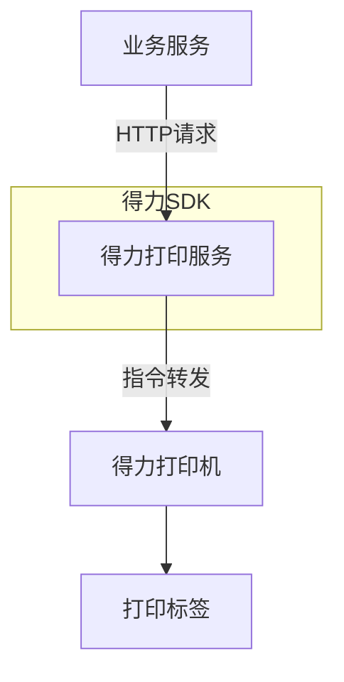

#### 7.1.2 打印服务实现

**DeliPrintService.java**

```java
@Service
@Slf4j
public class DeliPrintService {

    @Value("${deli.print.api.url}")
    private String apiUrl;

    @Value("${deli.print.api.key}")
    private String apiKey;

    @Value("${deli.print.api.secret}")
    private String apiSecret;

    @Resource
    private RestTemplate restTemplate;

    /**
     * 打印标签
     * @param labelData 标签数据
     * @return 打印结果
     */
    public PrintResult printLabel(PrintLabelData labelData) {
        try {
            // 构建打印指令
            PrintCommand command = buildPrintCommand(labelData);

            // 调用得力打印API
            String response = callPrintApi(command);

            // 解析响应
            PrintResponse printResponse = JSON.parseObject(response, PrintResponse.class);

            if (printResponse.isSuccess()) {
                return PrintResult.success(printResponse.getTaskId());
            } else {
                return PrintResult.fail(printResponse.getErrorMsg());
            }

        } catch (Exception e) {
            log.error("打印失败", e);
            return PrintResult.fail("打印服务异常：" + e.getMessage());
        }
    }

    private PrintCommand buildPrintCommand(PrintLabelData labelData) {
        PrintCommand command = new PrintCommand();

        // 设置打印机（根据配置选择）
        command.setPrinterId(getDefaultPrinterId());

        // 构建标签内容
        LabelContent content = new LabelContent();

        // 箱号条码
        Barcode barcode = new Barcode();
        barcode.setType("CODE128");
        barcode.setData(labelData.getBoxNo());
        barcode.setWidth(300);
        barcode.setHeight(80);
        content.addElement(barcode);

        // 文本信息
        TextElement woNoText = new TextElement();
        woNoText.setX(10);
        woNoText.setY(100);
        woNoText.setFontSize(14);
        woNoText.setText("备货单号：" + labelData.getWoNo());
        content.addElement(woNoText);

        TextElement meterCountText = new TextElement();
        meterCountText.setX(10);
        meterCountText.setY(130);
        meterCountText.setFontSize(12);
        meterCountText.setText("设备数量：" + labelData.getMeterCount() + "台");
        content.addElement(meterCountText);

        TextElement meterTypeText = new TextElement();
        meterTypeText.setX(10);
        meterTypeText.setY(160);
        meterTypeText.setFontSize(12);
        meterTypeText.setText("型号：" + labelData.getMeterType() + " " + labelData.getMeterCaliber());
        content.addElement(meterTypeText);

        TextElement inspectorText = new TextElement();
        inspectorText.setX(10);
        inspectorText.setY(190);
        inspectorText.setFontSize(10);
        inspectorText.setText("检验员：" + labelData.getInspector());
        content.addElement(inspectorText);

        TextElement timeText = new TextElement();
        timeText.setX(10);
        timeText.setY(210);
        timeText.setFontSize(10);
        timeText.setText("包装时间：" + DateUtil.format(labelData.getPackagingTime(), "yyyy-MM-dd HH:mm"));
        content.addElement(timeText);

        command.setContent(content);
        command.setCopies(1);

        return command;
    }

    private String callPrintApi(PrintCommand command) {
        HttpHeaders headers = new HttpHeaders();
        headers.setContentType(MediaType.APPLICATION_JSON);
        headers.set("X-App-Key", apiKey);
        headers.set("X-App-Secret", apiSecret);

        HttpEntity<PrintCommand> request = new HttpEntity<>(command, headers);

        ResponseEntity<String> response = restTemplate.postForEntity(
            apiUrl + "/api/print",
            request,
            String.class
        );

        return response.getBody();
    }
}
```

---

## 第八章 部署方案

### 8.1 Docker容器化部署

#### 8.1.1 Dockerfile

```dockerfile
# 多阶段构建
FROM maven:3.8.6-openjdk-8 AS builder
WORKDIR /app

# 复制pom.xml并下载依赖
COPY pom.xml .
RUN mvn dependency:go-offline -B

# 复制源代码并构建
COPY src ./src
RUN mvn package -DskipTests

# 运行阶段
FROM openjdk:8-jdk-slim
WORKDIR /app

# 安装必要的工具
RUN apt-get update && apt-get install -y \
    curl \
    && rm -rf /var/lib/apt/lists/*

# 从构建阶段复制jar包
COPY --from=builder /app/target/*.jar app.jar

# 健康检查
HEALTHCHECK --interval=30s --timeout=3s --retries=3 \
    CMD curl -f http://localhost:8080/actuator/health || exit 1

# 环境变量配置
ENV JAVA_OPTS="-Xms512m -Xmx1024m -XX:+UseG1GC"
ENV SPRING_PROFILES_ACTIVE=prod

EXPOSE 8080

ENTRYPOINT ["sh", "-c", "java $JAVA_OPTS -jar app.jar"]
```

#### 8.1.2 docker-compose.yml

```yaml
version: '3.8'

services:
  # MySQL主库
  mysql-master:
    image: mysql:8.0
    container_name: mysql-master
    ports:
      - "3306:3306"
    environment:
      - MYSQL_ROOT_PASSWORD=${MYSQL_ROOT_PASSWORD}
      - MYSQL_DATABASE=production_system
    volumes:
      - mysql-master-data:/var/lib/mysql
      - ./docker/mysql/master.cnf:/etc/mysql/conf.d/custom.cnf
    networks:
      - production-network
    restart: unless-stopped

  # MySQL从库
  mysql-slave:
    image: mysql:8.0
    container_name: mysql-slave
    ports:
      - "3307:3306"
    environment:
      - MYSQL_ROOT_PASSWORD=${MYSQL_ROOT_PASSWORD}
    volumes:
      - mysql-slave-data:/var/lib/mysql
      - ./docker/mysql/slave.cnf:/etc/mysql/conf.d/custom.cnf
    networks:
      - production-network
    restart: unless-stopped
    depends_on:
      - mysql-master

  # Redis
  redis:
    image: redis:6.2-alpine
    container_name: redis
    ports:
      - "6379:6379"
    command: redis-server --appendonly yes --requirepass ${REDIS_PASSWORD}
    volumes:
      - redis-data:/data
    networks:
      - production-network
    restart: unless-stopped

  # RabbitMQ
  rabbitmq:
    image: rabbitmq:3.9-management-alpine
    container_name: rabbitmq
    ports:
      - "5672:5672"
      - "15672:15672"
    environment:
      - RABBITMQ_DEFAULT_USER=${RABBITMQ_USER}
      - RABBITMQ_DEFAULT_PASS=${RABBITMQ_PASSWORD}
    volumes:
      - rabbitmq-data:/var/lib/rabbitmq
    networks:
      - production-network
    restart: unless-stopped

  # 应用服务
  production-service:
    image: production-service:latest
    container_name: production-service
    ports:
      - "8080:8080"
    environment:
      - SPRING_PROFILES_ACTIVE=prod
      - SPRING_DATASOURCE_URL=jdbc:mysql://mysql-master:3306/production_system
      - SPRING_DATASOURCE_USERNAME=root
      - SPRING_DATASOURCE_PASSWORD=${MYSQL_ROOT_PASSWORD}
      - SPRING_REDIS_HOST=redis
      - SPRING_REDIS_PASSWORD=${REDIS_PASSWORD}
      - SPRING_RABBITMQ_HOST=rabbitmq
      - SPRING_RABBITMQ_USERNAME=${RABBITMQ_USER}
      - SPRING_RABBITMQ_PASSWORD=${RABBITMQ_PASSWORD}
    depends_on:
      - mysql-master
      - mysql-slave
      - redis
      - rabbitmq
    networks:
      - production-network
    restart: unless-stopped
    healthcheck:
      test: ["CMD", "curl", "-f", "http://localhost:8080/actuator/health"]
      interval: 30s
      timeout: 10s
      retries: 3

networks:
  production-network:
    driver: bridge

volumes:
  mysql-master-data:
  mysql-slave-data:
  redis-data:
  rabbitmq-data:
```

### 8.2 环境变量配置

```bash
# .env文件
# MySQL配置
MYSQL_ROOT_PASSWORD=your_mysql_password

# Redis配置
REDIS_PASSWORD=your_redis_password

# RabbitMQ配置
RABBITMQ_USER=admin
RABBITMQ_PASSWORD=your_rabbitmq_password

# 得力打印配置
DELI_PRINT_API_URL=http://print-service:8081
DELI_PRINT_API_KEY=your_api_key
DELI_PRINT_API_SECRET=your_api_secret
```

---

## 第九章 附录

### 9.1 协议数据格式

#### SR协议数据格式

| 字段 | 字节偏移 | 长度 | 数据类型 | 说明 |
|------|----------|------|----------|------|
| 帧头 | 0 | 1 | BYTE | 0x68 |
| 表号 | 1-14 | 14 | ASCII | 14位表号 |
| IMEI | 15-29 | 15 | ASCII | 15位IMEI |
| 正向累积流量 | 30-37 | 8 | BCD | 3位小数 |
| 反向累积流量 | 38-45 | 8 | BCD | 3位小数 |
| 阀门状态 | 46 | 1 | BYTE | 0-关，1-开，2-故障 |
| 电池电压 | 47-48 | 2 | BCD | 1位小数 |
| CSQ | 49 | 1 | BYTE | 信号强度 |
| RSRP | 50-51 | 2 | SHORT | 信号功率 |
| RSRQ | 52-53 | 2 | SHORT | 信号质量 |
| 环境温度 | 54-55 | 2 | BCD | 1位小数，带符号 |
| 压力 | 56-59 | 4 | BCD | 2位小数 |
| 上报时间 | 60-66 | 7 | BCD | YYMMDDHHmmss |
| CRC | 67 | 1 | BYTE | 校验和 |
| 帧尾 | 68 | 1 | BYTE | 0x16 |

### 9.2 状态枚举值

| 枚举类型 | 枚举值 | 说明 |
|----------|--------|------|
| 库存状态 | 0 | 在库 |
| 库存状态 | 1 | 已出库 |
| 测试状态 | 0 | 待测 |
| 测试状态 | 1 | 合格 |
| 测试状态 | 2 | 不合格 |
| 阀门状态 | 0 | 关 |
| 阀门状态 | 1 | 开 |
| 阀门状态 | 2 | 故障 |
| 判定状态 | pending | 测试中 |
| 判定状态 | passed | 合格 |
| 判定状态 | failed | 不合格 |
| 通讯协议 | 1 | SR协议 |
| 通讯协议 | 2 | 恩乐曼协议 |
| 通讯协议 | 3 | CJT188协议 |
| 包装层级 | 1 | 备货单号层 |
| 包装层级 | 2 | 箱号层 |
| 包装层级 | 3 | 单表号层 |

### 9.3 变更记录

| 版本 | 日期 | 修改人 | 修改内容 |
|------|------|--------|----------|
| V1.0 | 2026-03-20 | MiniMax Agent | 初始版本 |

---

**文档结束**

